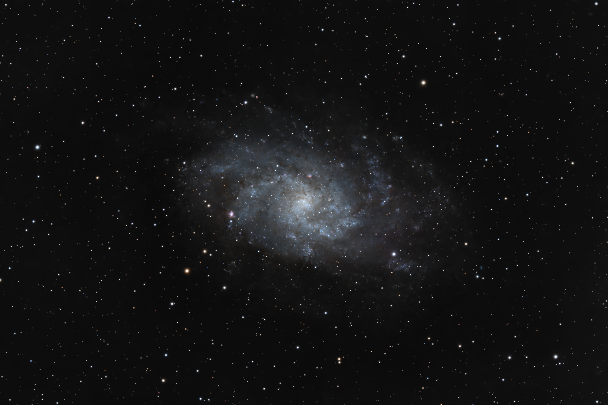
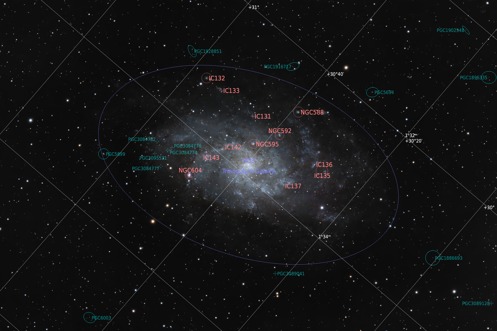

# Triangulum Galaxy

## Acquisition

I decided to give M33 a go in a clear and moonless night even though I knew that
shooting a faint, broadband target like this was not a good idea. Overall I
collected 94 x 180s light frames which resulted in 4.7 hours of integration time.

## Linear processing

I started selecting a dark region of the background not too far from the galaxy
and then used **SpectrophotometricColorCalibration** to calibrate the colors. I
decided to crop the image heavily because the strong gradient proved to be
difficult to remove and not removing the gradient correctly caused issues to
[StarXTerminator]. I went for a 3x2 aspect ratio, keeping the galaxy well
centered in the frame. I used **DynamicBackgroundExtraction** to model the
background, selecting a good number of samples using 1.5 tolerance and avoiding
the central part of the image where the faint, outer arms of the galaxy were
barely noticeable. I then used [BlurXTerminator] (default settings),
[StarXTerminator] (*unscreen* deselected) and [NoiseXTerminator] (denoise: 0.9,
iterations: 5) to deconvolve and denoise the image and separate the galaxy from
the stars.

## Non-linear processing

I used [Seti Astro]'s **Statistical Stretch** (target median: 0.15) script to
bring the galaxy to non-linear state. I wanted to stretch the galaxy some more,
but the script proved to be too aggressive, so I decided to perform some manual
stretch later on. I used **HistogramTransformation** to clip the unused part of
the dynamic range. At this point I used **CurvesTransformation** on the
luminance to slightly increase the visibility of the fainter arms. I defined a
tight S-curve (0.098 to 0.092 and 0.148 to 0.162) near the bottom of the dynamic
range, making sure that the core of the galaxy did not become too bright. I then
used **LocalHistograEqualization** (radius: 282, amount: 0.3) to increase the
contrast in between the arms.

I created a mask for the galaxy, making sure not to include any patch that was
still lurking in the corners of the image. I colorized the masked image with
**CurvesTransformation**, inverted the mask and used **CurvesTransformation**
once again to desaturate the background. I then used **SCNR** to remove the
green noise and made a final denoising with [NoiseXTerminator]. I decided to
lower the brightness of the background a little more using
**HistogramTransformation**.

I stretched the stars using [Seti Astro]'s **Star Stretch** (default settings
and green denoising enabled) and merged galaxy and stars using [ImageBlend].

## Things to be improved

Obviously this target requires far more integration time to allow for a more
prominent stretch of the fainter parts of the galaxy. Also, I don't like the
fact that the galaxy is almost (but not perfectly) horizontal in the frame. The
inclination should be increased so that it's clear that it is intentional and
not accidental.


