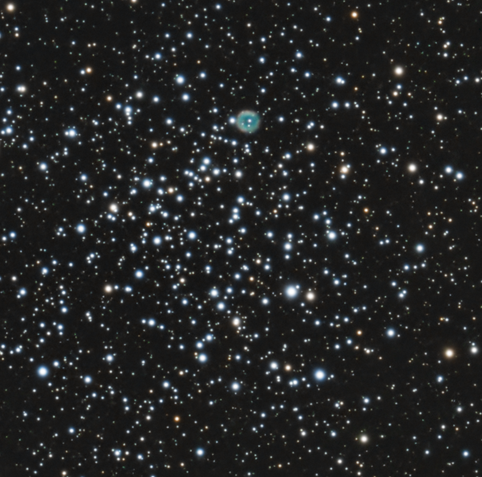

# M46

2 March 2024

## Imaging and processing

{:.aside}

I took one hour worth of data of this open cluster using my SharpStar 76EDPH
with 0.8x reducer and the ASI533MC Pro with an Astronomik UV-IR cut filter. The
cluster is notable for the presence of an "embedded" planetary nebula (NGC 2439)
which is likely unrelated to the cluster itself. It stands out because of its
teal color in a sea of blue and orange stars.

Processing was easy. Given that there was virtually no nebulosity, I used Seti
Astro's **Automatic DBE** to remove the gradient from the stack and calibrated
the colors with **SpectroPhotometricColorCalibration**. To correct the stars I
used [BlurXTerminator], making sure to increase the halo to its maximum value
(0.50) since all the star color lies there. I applied [NoiseXTerminator] to
reduce the noise and then used Seti Astro's **Star Stretch** to bring the image
to non-linear state. I did not select the option to remove the green noise
though, since I feared that would have washed out the planetary nebula.
Stretching increased the background brightness way too much, so I took it down
with **HistogramTransformation**. At this point I noticed that **4 Puppis** (the
bright star in the upper-left corner) had a magenta halo, so I inverted the
image, removed the green noise with **SCNR**, and inverted back the image. The
magenta halo was gone. As a final step, I applied a gentle curve with
**CurvesTransformation** to increase color saturation by a touch.

Looking closely at the annotated image one notices that there are two identical
labels **2 Pup** on the star in the upper-left corner. In fact, the star has a
slightly oblong shape. That is a binary star, but my telescope is not powerful
enough to resolve it properly. In the bottom-right corner is another open
cluster, NGC 2425, which is much older than M46.

[BlurXTerminator]: https://www.rc-astro.com/software/bxt/
[NoiseXTerminator]: https://www.rc-astro.com/software/nxt/
