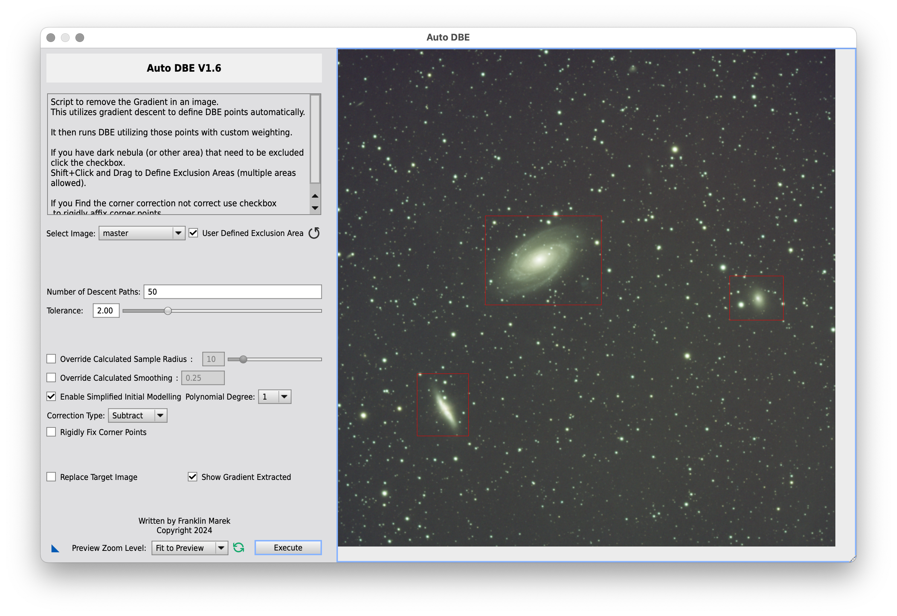
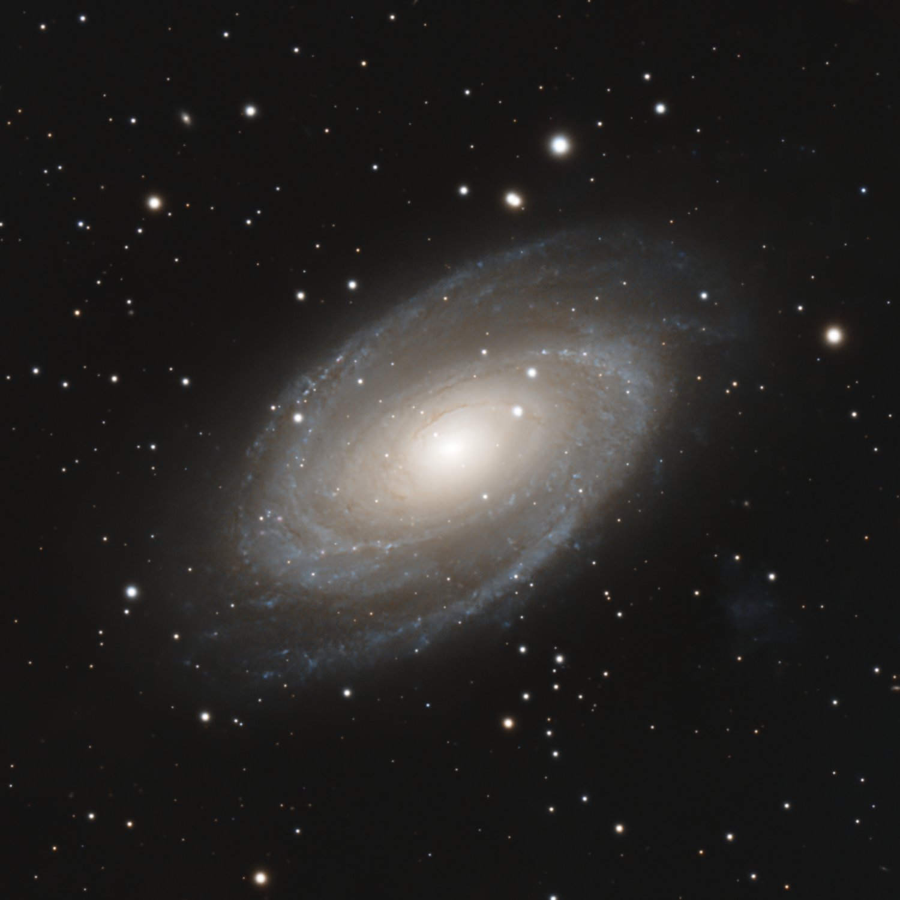

# Bode's Galaxy and Cigar Galaxy

13 February 2024

I imaged [Bode's Galaxy (M81)](https://en.wikipedia.org/wiki/Messier_81) and the
[Cigar Galaxy (M82)](https://en.wikipedia.org/wiki/Messier_82) from a Bortle 4
sky for a nearly 4 hours using a SharpStar 76EDPH reduced at .8x and an ASI533MC
Pro with a UV-IR cut filter.

{:.aside .noshadow}

I color calibrated the image using **SpectroPhotometricColorCalibration**,
selecting a dark region in the bottom-right corner as background reference. I
then cropped the image to get rid of some stacking artifacts and used Seti
Astro's **Automatic DBE** to remove the background gradient. I excluded the main
galaxies so that they did not contribute to the background model.

I applied [BlurXTerminator], [StarXTerminator] and [NoiseXTerminator] to
deconvolve, reduce noise and separate the galaxies from the stars.

I used [Seti Astro]'s **Statistical Stretch** to stretch the starless image to
non-linear state, using 0.10 as target background level. I then increased
contrast with a gentle curve in **GHS** (stretch factor: 0.6, local intensity:
6.39, symmetry point: 0.24, highlights protection: 0.38), looking at the spiral
arms of M81 as reference but being careful not to bloat the galaxies too much. I
felt the galaxies had some kind of greenish tint, so I used **SCNR** to get rid
of the green noise. Suddenly, they became much warmer and more pleasing to the
eye.

{:.aside}

At this stage I wanted to sharpen the dust lanes of M81 as much as I could. I
created a range mask to protect the background and I tried various strategies,
but in the end **MultiscaleLinearTransform** appeard to be the best tool (layer
2 at 0.2 and layer 3 at 0.1, without noise reduction). Being more aggressive
only deteriorated the details and introduced bright artifacts, likely because of
the limited resolution of the SharpStar 76EDPH. I then increased color
saturation in two steps using **CurvesTransformation**. The colors in both M81
and M82 are subtle but pleasing, especially the blue spiral arms in the former
galaxy.

I went ahead stretching the stars-only image using [Seti Astro]'s **Star
Stretch**, also enabling green noise reduction. I then obtained the final image
using [ImageBlend].

I never liked the framing in this image and I've never managed to bring out the
red tendrils out of M82 as much as I wanted. Also, they look more orange than
red. But these galaxies are small for the SharpStar 76EDPH anyway and deserve to
be imaged again with a more powerful scope.

Annotating the image revealed that the faint, blue smudge next to M81 is
actually a galaxy called **Holmberg IX** and catalogued PGC 28757!


