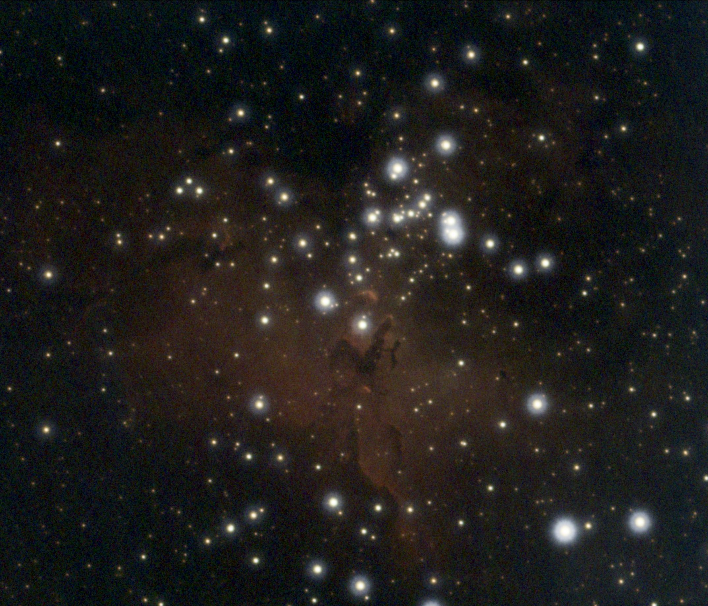

# Eagle Nebula

June 2024

I collected data on M16 during 6 nights in June 2024 using a SharpStar 76EDPH
reduced at 0.8 and an ASI533MC Pro with an Optolong L-ENHANCE filter. Overall I
obtained nearly 15 hours of integration time. I stacked and drizzled the frames
using **WBPP** and used the autocropped master since the scope and camera had
moved quite a bit in those nights and there appeared to be an irregular border
all around the picture with significant noise. I further cropped the image to
obtain a perfectly square frame.

M16 lies in a region of the sky quite close to the core of Milky Way, where
there are plenty of stars and the whole frame is filled with irregular
nebulosity. Therefore, I used **AutomaticBackgroundExtractor** (degree: 1) to
remove the background gradient instead of fiddling with samples. I then applied
[BlurXTerminator] (default settings), [NoiseXTerminator] (denoise: 0.8,
iterations: 5) and [StarXTerminator]. I then performed an *unlinked* stretch
using [Seti Astro]'s **Statistical Stretch** script (target median: 0.25).

{:.aside}

The core of M16, where the iconic Pillars of creation are located, is very
bright and there was little contrast in the image. Therefore, I applied
**HDRMultiscaleTransform** (layers: 9) to *lightness* also enabling the
*lightness mask*. This increased the contrast gently, without darkening the core
of the nebula too much. I then converted the RGB image to the Foraxx palette
using my **PixelMath** process icon. At this stage the image was quite bright,
so I applied **HistogramTransformation** to clip the unused lower part of the
dynamic range.

Before enhancing the colors, I wanted to better separate the red channel from
the green and blue channels. To this aim, I first applied **GHS** (stretch
factor: 0.44, local intensity: 0.5, symmetry point: 0.52) to the green channel
and then **GHS** (stretch factor: 0.44, local intensity: 0.5, symmetry point:
0.52) to the blue channel. I colorized the image applying
**CurvesTransformation** (input: 0.44, output: 0.58) twice. I then applied
**SCNR** to reduce the level of green. I finalized the contrast by applying
**LocalHistogramEqualization** (kernel radius: 170, amount: 0.2) and applied
[NoiseXTerminator] (denoise: 0.9, iterations: 5) once again.

I stretched the stars-only image using [Seti Astro]'s **Star Stretch** with
green-noise removal enabled. I then saturated the stars a little bit more using
**CurvesTransformation** before merging them with the nebula using [ImageBlend].

Needless to say, the result is very different from the SHO renderings that can
be found online. Unfortunately, it seems to be difficult to obtain versions of
M16 featuring a variety of different colors using a dual narrowband filter. The
aspect I like of this version is that the inner part of the nebula has a foggy
nature with very delicate shades of blue. In the upper-left part of the image is
Trumpler 32, a faint open cluster that is not listed in the catalogues used to
annotate the image.

## Fun facts

{:.aside}

The Eagle nebula has a special meaning for me because I took a picture of it on
the 25th of June 2023, the night I realized that it was possible to image
deep-sky objects from a city. That night I was using an achromat f/11 refractor
on an Alt-Az mount and I managed to (live) stack 93 x 10s frames for a total
integration time barely over 1 minutes.


