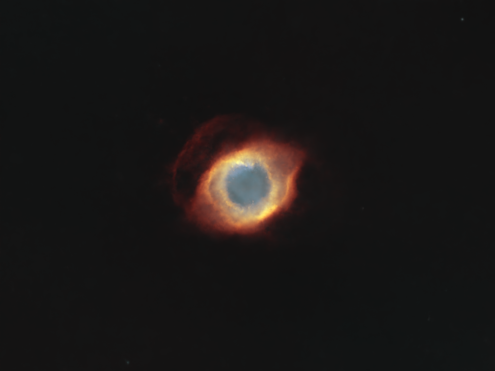
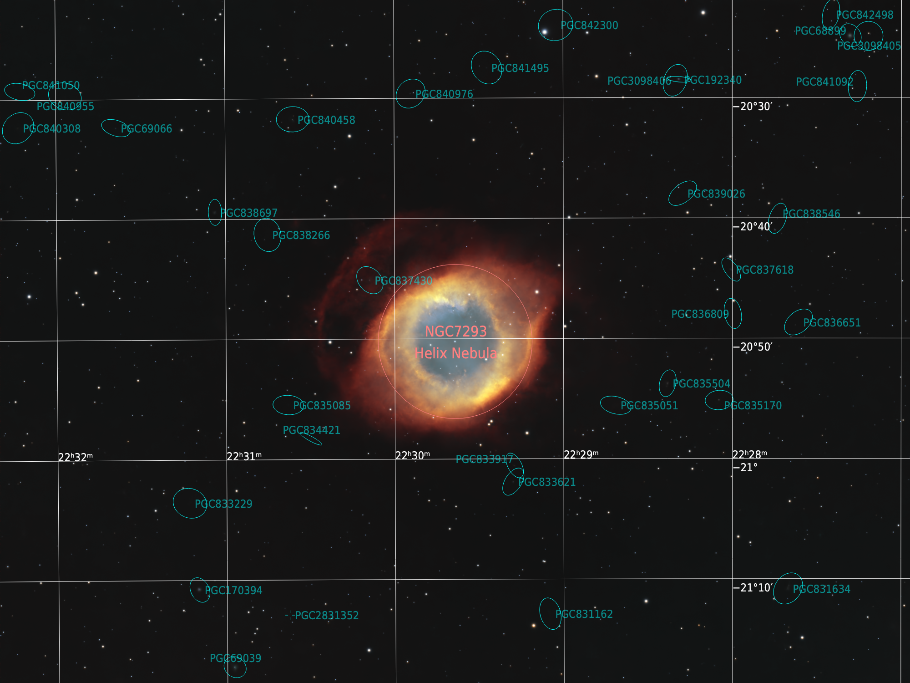

# Helix Nebula -- NGC 7293

6 September 2024

I imaged this nebula on several nights in the summer of 2024 using a SharpStar
76EDPH and an ASI533MC Pro with L-ENHANCE filter. Overall I collected 104 x 180s
light frames in the nights of 12th, 13th, 23rd, 24th, 30th, 31st of August and
on 6th September.

## Linear post-processing

The Helix nebula is located in a relatively featureless region of the sky, hence
I used **DynamicCrop** to crop the (drizzled) master light image substantially
to a 4000x3000 rectangle. I also rotated the crop so that the nebula would not
appear perfectly horizontal, but slightly slanted on one side. In this case the
cropping is made easy by the fact that the gas-emitting star, which is
approaching the end of its life, is visible at the very center of the nebula as
a bluish dot and makes for the perfect rotation point.

The background gradient was very gentle and smooth also because of the heavy
cropping. Therefore, I used **AutomaticBackgroundExtractor** (function degree:
1) to remove the gradient. I then proceeded with the usual sequence of
[BlurXTerminator] (default settings), [NoiseXTerminator] (default settings) and
[StarXTerminator]. The new AI version 3 of [NoiseXTerminator], in particular,
does a fantastic job in bringing out the faintest structure of the outer, faint
rings surrounding the nebula.

I ended this processing phase stretching the image with Seti Astro's
**Statistical Stretch** selecting the unlinked mode. Becase the nebula occupies
a small portion of the frame, I lowered the target median to 0.05.

## Non-linear post-processing

I used **GHS** to enhance the visibility of the faint loops surrounding the
nebula. To that aim, I chose a symmetry point in a dark region inside the loop
and performed a gentle stretch (stretch factor: 1, local intensity: 1.5,
highlights protection: 0.2). It was fundamental to lower the highlights
protection value since I didn't want to stretch the bright areas more. I did
another linear stretch with **GHS** to clip most of the unused dynamic range.

{:.aside}

At this point I switched to the Foraxx palette using **PixelMath**. Before
boosting the colors I created a mask using **RangeSelection**, making sure that
the mask included at least some of the faintest parts of the loop. I used
**CurvesTransformation** twice to colorize the image. I also wanted to enhance
the nebula's structure a little, but neither **UnsharpMask** nor
**LocalHistogramEqualization** seemed to produce nice results. Therefore,
violating one of the holy rules of deconvolution, I applied [BlurXTerminator]
once more disabling stellar sharpening, selecting PSF diameter 5 and boosting
non-stellar sharpening to 0.6. I removed the mask and ran [NoiseXTerminator]
once again to smooth out a subtle noise that had surfaced in the background and
some regions of the nebula.

I stretched the stars using Seti Astro's **Star Stretch**. I enabled green noise
removal and increased the stretch amount to 5.5 given that the nebula is
isolated and the stars are dim in this region of the sky. I merged nebula and
stars with [ImageBlend].

## Fun facts

When I chose the rotation of the nebula I didn't know that the frame would end
up almost perfectly squared to the equatorial coordinate system that is visible
in the annotated image above <i class="fa-regular fa-face-smile"></i>.

[BlurXTerminator]: https://www.rc-astro.com/software/bxt/
[StarXTerminator]: https://www.rc-astro.com/software/sxt/
[NoiseXTerminator]: https://www.rc-astro.com/software/nxt/
[ImageBlend]: https://cosmicphotons.com/scripts/
