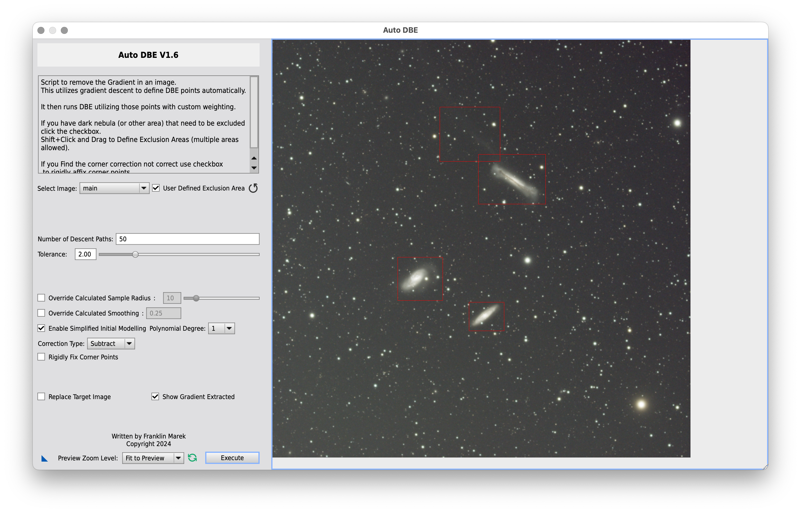

# Leo Triplet -- NGC 3628, M65 and M66

March 2024

This image is the result of roughly 2 hours worth of data collected from a
Bortle 4 sky, using a SharpStar 76EDPH with .8x reducer and an ASI533MC Pro with
an SvBony UV-IR cut filter. It depicts the famous trio of galaxies known as the
"Leo Triplet", consisting of [NGC 3628](https://en.wikipedia.org/wiki/NGC_3628)
(the "hamburger" galaxy), [M65](https://en.wikipedia.org/wiki/Messier_65) and
[M66](https://en.wikipedia.org/wiki/Messier_66) (clockwise in the image).

{:.aside .noshadow}

Before cropping the master light to remove stacking artifacts around the border
I used **SpectroPhotometricColorCalibration** to calibrate the colors. Then, I
applied [Seti Astro]'s **Automatic DBE**  to remove the gradient. I excluded the
three main galaxies as well as the region next to NGC 3628 where the "tail" of
the galaxy was supposed to be. I was really hoping to bring it out in the final
image.

I proceeded to deconvolving the image with [BlurXTerminator]. At that point I
separated galaxies and stars with [StarXTerminator] and used [NoiseXTerminator]
to tame the noise in the starless image.

{:.aside}

I brought the starless image to the non-linear state using [Seti Astro]'s
**Statistical Stretch** with target background 0.10. I then used **GHS** to
apply a very gentle S-curve so as to increase the contrast between the
background and the faint tail of NGC 3628 (stretch factor: 0.52, local
intensity: 15, symmetry point: 0.13, highlights protection: 0.21). I tried to do
the same with **CurvesTransformation** and **HistogramTransformation**, but in
the end **GHS** proved to be the tool providing the most accurate fine-tuning.

To finalize the main galaxies I created a range mask and then I used
**MultiscaleLinearTransform** to increase the level of detail in the dust lanes
of NGC 3628 and M66. I enabled layers 2 (detail: 0.2) and 3 (detail: 0.1) with
the respective noise reduction at the default settings. I noticed some green
coloring popping up, which I removed with an application of **SCNR**. I then
slightly increased saturation with **CurvesTransformation** and removed the
noise that had appeared with another application of [NoiseXTerminator].

I stretched the stars using [Seti Astro]'s **Star Stretch** (increasing color
saturation to 1.5 and enabling green noise removal) and combined them with the
galaxies using [ImageBlend].

The tail of NGC 3628 is very faint but visible (it is estimated to be more than
300000 light years long!) and I'm also happy to see the faint, external spiral
arms of M66. What I found really stunning, looking at the annotated image, is
the fact that many "dots" of light in this image are not stars, but galaxies!

 


