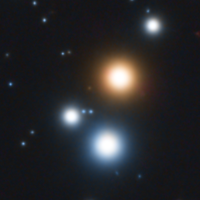
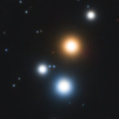

# Beehive Open Cluster -- M44

16 March 2025

This is my attempt at photographing the **Beehive Open Cluster** (the 44th
object in Charles Messier catalogue) in the constellation Cancer. Since the
cluster's apparent size is quite big, I used my Askar FMA180 Pro and the
ASI533MC Pro. Also, I tried using the Optolong L-PRO filter which had been left
unused for quite a long time in a drawer with astro-related gear. I managed to
take 104 60-seconds light frames in a sky brightened by a fairly large moon and
a few occasional passing clouds, but with little to no humidity in the air.

Open clusters are easy to process because there is no nebulosity to tease out,
the only things that matter are the stars and their colors. I used
**SpectroPhotometricColorCalibration** to calibrate the colors, after having
selected a dark region in the bottom-left corner of the image. Then I cropped
the frame quite heavily using **DynamicCrop**, because for some reason the scope
moved shortly after the meridian flip and a number of frames had been shot with
the cluster off center.

I had kept the single exposures short (60 seconds) to avoid star saturation and
retain most of the color in their cores. Nonetheless, I also tried using the
**Repaired HSV Separation** script, which apparently improves coloring and helps
avoiding magenta cores. The script yielded three images for the
Hue/Saturation/Value channels which I then combined into RGB using
**ChannelCombination** and selecting the HSV color model (later I realized that
the script also has an option to automatically generate the repaired RGB image).

From there I used [BlurXTerminator] to correct the stars. I didn't want the
stars to become too small. In fact, I wanted star halos to be very visible since
most of the color lies there. So I lowered "sharpen stars" to 0.2 and increased
"adjust star halos" to 0.5. Next I used [NoiseXTerminator] to smooth out the
background noise.

I stretched the image using [Seti Astro]'s **Star Stretch**, bumping up both the
stretch amount to 5.5 and the "color boost" to 1.5. I also enabled green noise
removal, which I noticed in some star halos. I then used
**CurvesTransformation** to further saturate the star colors in two steps.

## Repaired versus unrepaired stars

    
    

I ran the same processing workflow twice, once on the "unrepaired" image and
again on the image that had been corrected by the **Repaired HSV Separation**
script. There is a subtle but noticeable difference in the image obtained
through the script in that star halos are slightly more saturated and extend a
little bit further (but not all the way) into the cores. Also, the script seems
to clip the unused part of the dynamic range, so that it is not necessary to
explicitly use **HistogramTransformation** after tretching. Aside is a
comparison of the two runs on one part of M44 (hover to see the repaired
version). Overall I'm still not sure I used the script to the best of its
potential, but it seemed to slightly improve the final outcome.


