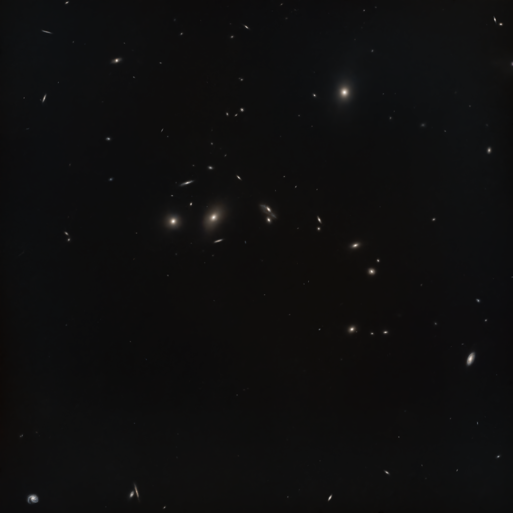

# Markarian's Chain

21 March 2025

During the second half of March 2025, in lack of better southern targets
crossing the meridian around midnight, I extensively shot the Markarian's chain
using the Askar FMA180 Pro with the ASI533MC Pro and the Optolong L-PRO filter.
I ended up collecting 358 light frames, way more than necessary for this target
at the focal length of the FMA180 Pro, but I wanted to be sure that the drizzled
image was as good as the non-drizzled one.

{:.aside}

I stacked and drizzled the frames with **WBPP**. I started post-processing using
**SpectroPhotometricColorCalibration** after having selected a dark region of
interest in one corners. I then used [BlurXTerminator] (default settings),
[NoiseXTerminator] (default settings) and [StarXTerminator]. It was important to
run [StarXTerminator] *after* [BlurXTerminator] to avoid getting residual
artifacts in the stars-only image.

I used Seti Astro's **Statistical Stretch** to perform the first stretch on the
starless image, setting the stretch amount to 0.10. I would have liked to
stretch the image a little bit more, but already at this level some bright
patches started emerging in the background, and I feared they would have been
more difficult to remove if I went for a stronger stretch. I dimmed the
background using a very gentle **GHS** curve (stretch factor: 0.78, local
intensity: 4.05, symmetry point: 0.16, highlights protection: 0.22) followed by
an application of **HistogramTransformation** to clip the darkest part of the
dynamic range. These did not eliminate the brighter patches entirely, but at
least made them so dim to be barely noticeable. I also used **SCNR** to remove a
faint green cast.

At this point I used **RangeSelection** to create a mask protecting the
background, I enhanced the structure within the most elaborate galaxies with
**MultiscaleLinearTransform** (layer 2 at 0.15) and I increased color saturation
twice using **CurvesTransformation**. I removed the mask and applied
[NoiseXTerminator] to eliminate the noise that emerged during/after stretching.

I processed the stars-only image using Seti Astro's **Star Stretch** script with
green noise removal enabled. I then merged the starless and stars-only images
with [ImageBlend]. I rotated the image so that the "hook" of the chain pointer
upwards and then plate solved and annotated the image.

I very much like the spiral arms of M99 (top-right) and the barred spiral galaxy
NGC 4440 (center-bottom).

[BlurXTerminator]: https://www.rc-astro.com/software/bxt/
[StarXTerminator]: https://www.rc-astro.com/software/sxt/
[NoiseXTerminator]: https://www.rc-astro.com/software/nxt/
[ImageBlend]: https://cosmicphotons.com/scripts/
