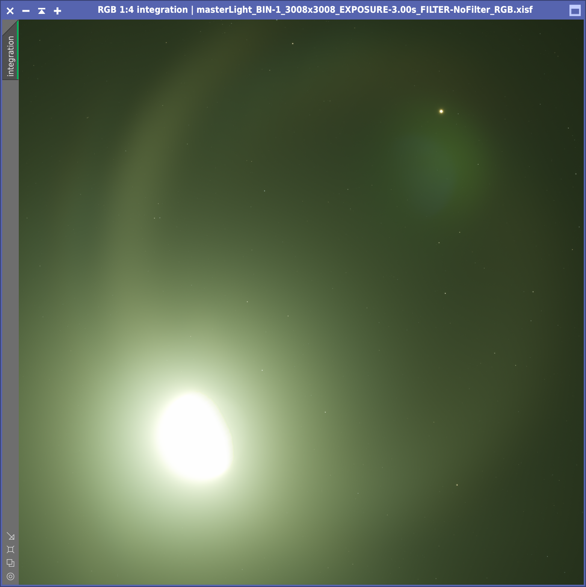
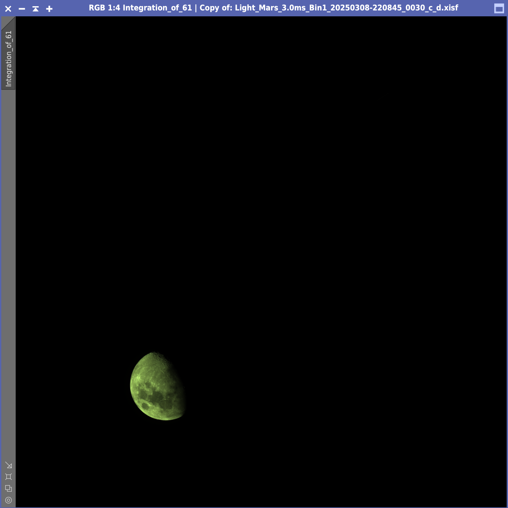
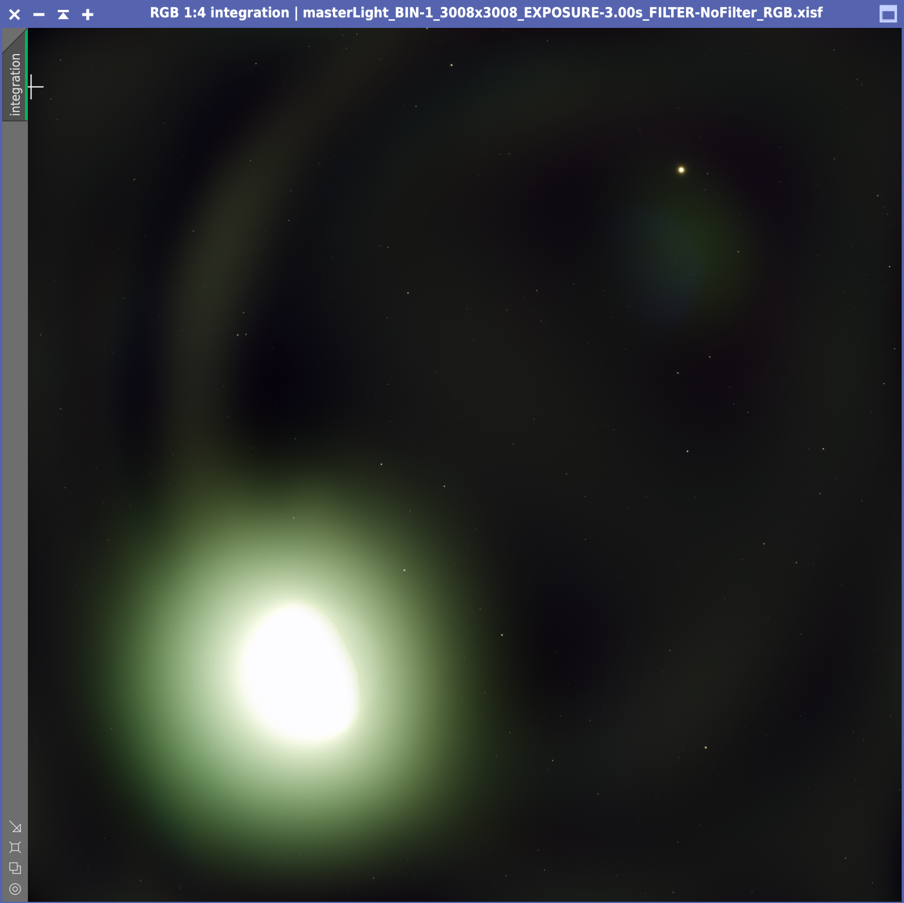
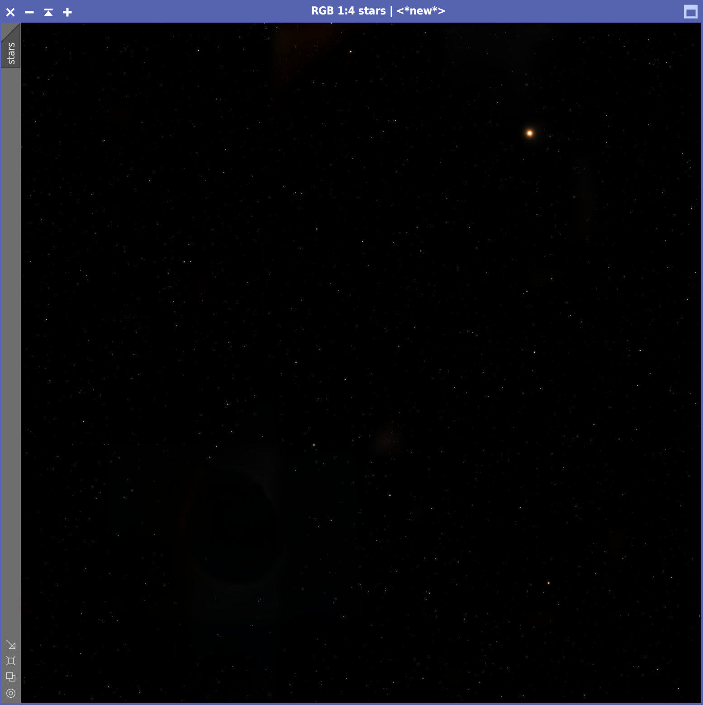
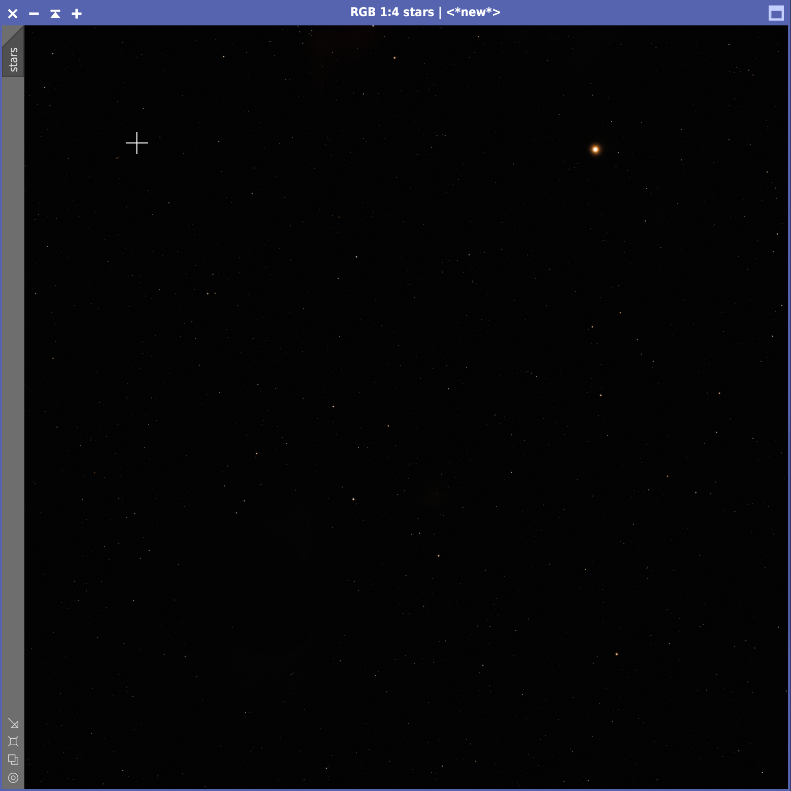
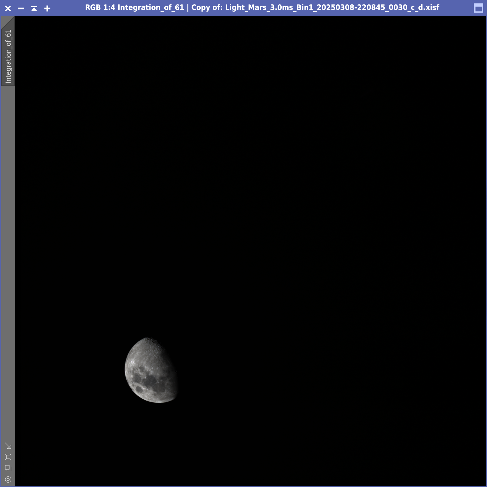
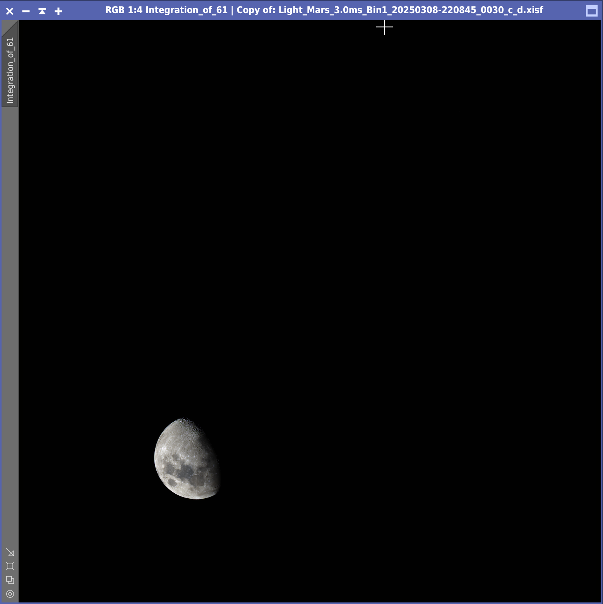
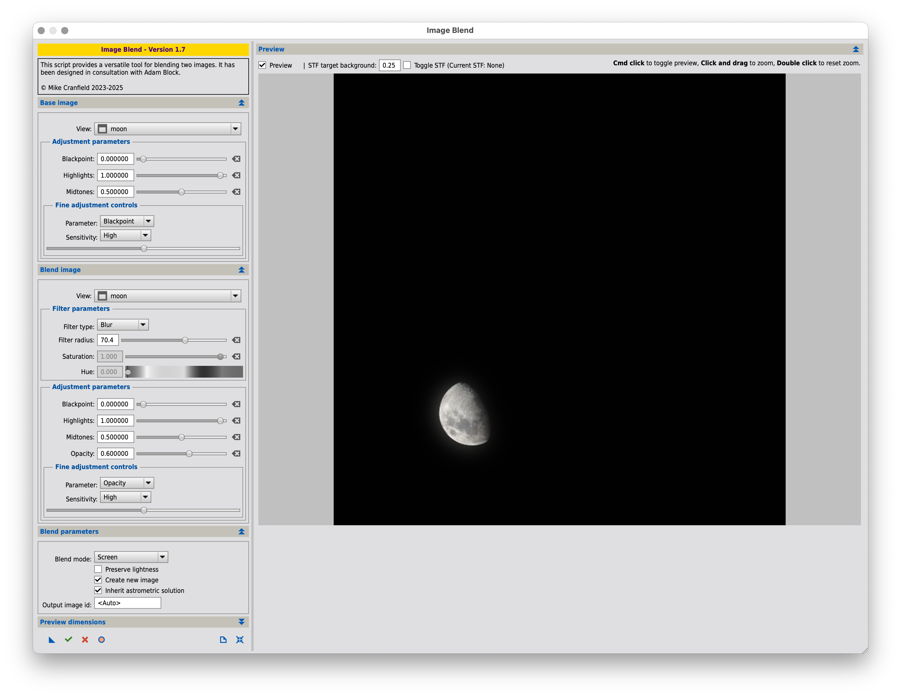
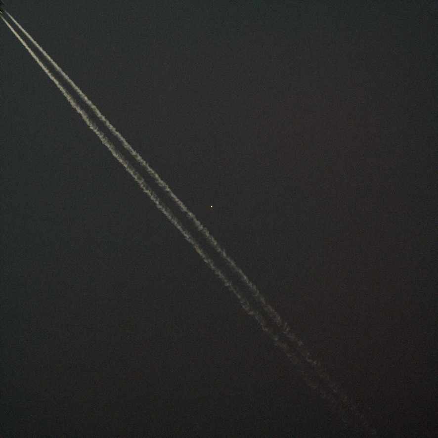

# Mars and the Moon

8 March 2025

On 8 March 2025 at around 22:00, Mars and the moon were close enough to fit
inside the sensor of the ASI533MC Pro connected to my Askar FMA180 Pro. I wanted
to try capturing a moon/planet conjunction, but I knew that the moon's
brightness would have made things quite difficult. During the imaging session I
captured

* 60 x 3s light frames (for the starry background)
* 60 x 3ms light frames (for the moon details)
* 50 x 1.28s flat frames
* 50 x 1.28s dark frames

using an Astronomik UV-IR cut filter.

## Preprocessing

I used **WBPP** to process and stack all frames, lowering both the calibration
exposure tolerance and the post-calibration exposure tolerance to 0 so as to
prevent PixInsight from stacking all the light frames together. As it happened,
stacking failed for the 3ms light frames anyway, likely because of the lack of
stars (Mars and the Moon were crossing
[Gemini](https://en.wikipedia.org/wiki/Gemini_(constellation)), in a region with
relatively few bright stars). This wasn't a big deal, since the point of
throwing the 3ms lights to **WBPP** was only to obtain the debayered files
automatically, which I could stack later with **FFTRegistration**.

### Star field stacking

{:class="aside"}

This is the result of stacking the 3s lights. Mars is clearly visible in the
upper-right corner, along with a number of bright stars. The brightness of the
moon (possibly intensified by some humidity in the air) caused a huge halo which
proved quite challenging to deal with in subsequent steps. The dark side of the
moon is also (barely) visible, but I couldn't find any way to salvage it from
the heavy processing of that region.

### Moon stacking

{:class="aside"}

In order to stack the moon from the 3ms light frames, I used
**FFTRegistration**. I added the debayered frames created by **WBPP** and
selected the 30th frame as reference frame. In this way, the resulting stack
showed the moon positioned roughly half way from the start to the end of the
imaging session. There was no need to specify an output directory, since all I
wanted was the stacked image.

Also this stacked image turned out to have a green cast likely due to the
Astronomik UV-IR filter I used while capturing frames.

## Post-processing of the star field

### Background extraction

{:class="aside"}

I tried to reduce the halo by running **ABE**. Given that the halo had a very
irregular shape, I raised the function degree to **11**. It took a lot of trial
and error to find the degree resulting in the "best" star field, the one with
the least amount of residual halo and that yielded fewer artifacts later on. The
result was not perfect, but it was OK: I was going to use just the stars from
this image anyway and I restored a mild artificial glow towards the end of
post-processing.

### Star extraction and stretching

{:class="aside"}

Next I used [BlurXTerminator] as if I were processing a plain nebula photo.
Since I was only interested in reducing stars (and Mars), I disabled nonstellar
sharpening. This also reduced any artifact that deconvolution could have
introduced and that could later be mistaken for a star. Then, I ran
[StarXTerminator] to remove the stars.

There were some residual artifacts around the moon, which I had to remove with
**CloneStamp**. Finally, I used [Seti Astro]'s [StarStretch] to stretch the stars.
I enabled the option to remove the green noise and I **decreased the stretch
amount to 4** so as to reduce the amount of artifacts that became visible after
the stretching and also not to have the dimmest stars visible. The point was
that around the moon (where the bright halo was strongest) there was going to be
a starless zone and if the rest of the sky was packed with stars such zone would
be very noticeable, once the moon was inserted back. So, I though it was better
seeing fewer stars but with the illusion of a more uniform star field across the
whole image.

{:class="aside"}

As I was using **CloneStamp**, I realized that there was still a dim trace of
the moon's halo such that the hole left by the moon was still noticeable. Since
the moon would not fill this hole entirely, I though it was better to darken the
background. To this aim, I created a star mark with **StarMask** and used
**CurvesTransformation** to clip the background to 0. Then, I used
**SimplexNoise** with amount 0.02 and scale 1 to restore a minimal noisy
background, so that it was not exactly black (no astro photo should have a
perfectly black background!).

## Post-processing of the moon

### Moon calibration

{:class="aside"}

I used **ColorCalibration** to get rid of the green cast. For the white and
black references, I created two previews in the moon stack, a small one
surrounding a bright crater and a larger one in the background. Color
calibration resulted is a neutral moon.

### Moon fine-tuning

{:class="aside"}

The moon did not require any stretching since it was already quite bright. I
used **CurvesTransformation** for increasing the brightness a touch and for
adding a little bit of contrast with a gentle S curve, being careful not to
overexpose the brightest craters.

I also increased saturation in two subsequent steps, so that the moon regained
some color. Finally, I used [BlurXTerminator] with default settings to sharpen
the details.

## Final image composition

### Moon glow

{:class="aside noshadow"}

I like the script [ImageBlend] by Mike Cranfield for merging images. Here I used
it twice. First of all, as explained in this [Adam Block's
video](https://www.youtube.com/watch?v=DQjs2yB_MAw), I used [ImageBlend] to add
a little bit of **glow** to the moon. The general idea is to combine the image
of the moon with itself, tweaking the filter parameters until we obtain a fairly
realistic halo.

Then I used [ImageBlend] once again to merge the moon (with halo) and the starry
background. I rotated the image by 180 degrees and used **DynamicCrop** to
remove a ~50 pixels border around the image, where the **FFTRegistration**
didn't have enough pixels to integrate.

### Image annotation

As a final step, I also generated an annotated version of the image. To that
aim, I needed to plate solve the image again. **ImageSolver** needed some help
and I searched for the star **47 Geminorum**, which I knew (from the automatic
plate solving done by **WBPP**) was in the picture. I also entered the exact
date in which the images were captured, as well as the focal length of the
telescope (174mm) and the pixel size (3.76). In **AnnotateImage** I also enabled
"Planets" annotations so that Mars could be properly annotated.

## Fun facts

{:class="aside"}

While I was focusing the telescope on
[Betelgeuse](https://en.wikipedia.org/wiki/Betelgeuse), well before the imaging
session, I accidentally saved one frame which later revealed the trail (and some
lights) of a passing plane that flew almost exactly over the giant star. What a
bizarre coincidence!


