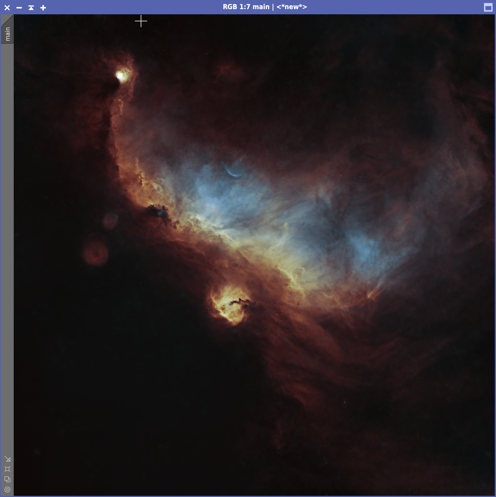

# Seagull Nebula -- IC 2177

March 2025

## Imaging sessions

At the beginning of March 2025 there was an extraordinary streak of clear
nights, no humidity and a young moon. I decided to take advantage of this week
to photograph what would probably have been the last nebula before summer time
(the balcony from which I'm shooting faces south and the galaxy season doesn't
offer much from that perspective).

Given the size of the target, I decided to use the Askar FMA180 Pro coupled with
the ASI533MC Pro and an Optolong L-ULTIMATE filter. The session ended up with:

* 287 x 300s light frames (barely under 24 hours)
* 50 x 4s flat frames
* 50 x 4s dark frames

## Preliminary processing

{:.aside}

I cropped ~100px around the border of the drizzled image to get rid of the
stacking artifacts caused by dithering. Since the telescope stayed mounted the
whole week, the framing was exactly the same and there was no need to further
crop the image.

The seagull nebula is relatively low at my latitude, which meant that the
resulting image presented a fairly strong gradient caused by light pollution. I
used **DynamicBackgroundExtraction** on this target, carefully avoiding the
areas containing significant nebulosity, increasing the tolerance to 3 and
placing numerous samples in the upper-left corner, where the gradient was
strongest.

I applied [BlurXTerminator] (default settings) to reduce the stars and to
sharpen the nebulosity. Then, I used [StarXTerminator] (with unscreen stars
deselected) to separate the stars from the nebula and applied [NoiseXTerminator]
(default settings, denoise = 0.90 and 5 iterations) to the nebula to get rid of
the background noise.

## Post-processing of the nebula

{:.aside}

I used Seti Astro's **Statistical Stretch** (target median = 0.20, unlinked
stretch) to bring the image to non-linear state. Then I applied **PixelMath** to
convert the RGB image into the Foraxx palette.

{:.aside}

At this point the image was clearly too bright. I used
**HistogramTransformation** to darken the image and get rid of the largely
useless pixels below the median. I ended up clipping around 1000 pixels, which
was not a big issue. After that, I used a gentle **GHS** curve to increase the
contrast (mode: RGB, stretch factor: 0.860, symmetry point: 0.45).

The picture was looking good, but I wanted to emphasize the bluish region under
the wings of the seagull even more. Therefore I performed two more **GHS**
stretches. The first one on the blue channel only (stretch factor: 0.6, local
intensity: 0.75, symmetry point: 0.6) and the second one on the green channel
only (stretch factor: 1.120, local intensity: 0, symmetry point: 0.5, protect
highlights: 0.75). It took a **long** time to get these parameters right,
because colors tend to shift with further processing. Also, after you've used
**GHS** on one of the individual channels, the color balancing is way off and it
is not easy to understand whether the stretch is appropriate or not. It would be
great if **GHS** allowed to preview the effect of multiple stretches on
different channels (like **CurvesTrasformation** does), but I understand that
the interface would be cumbersome to conceive. After these stretches, I found
that the image was slightly too bright, so I applied a gentle curve on the
luminance with **CurvesTransformation** to dim it a little.

{:.aside}

At this stage I wanted to add a bit of contrast to the image and highlight the
borders between different strata of nebulosity. I therefore created a blurry
mask with **RangeSelection** to protect the dark background and then applied
**LocalHistogramNormalization** (kernel radius: 50, contrast limit: 2, amount:
0.2). I increased color saturation with two gentle applications of
**CurvesTransformation**. I ran [NoiseXTerminator] once again, for getting rid
of the noise that had emerged from the various stretching phases. Finally, I
disabled the mask and ran **BackgroundNeutralization** to remove a slight
reddish cast that was left on the image. The nebula was done!

## Star stretching and blending

Star processing was easy thanks to Seti Astro's **Star Stretch** script. I made
sure to enable green noise removal and I increased the stretching of stars to
5.5 (many of them were really tiny or faint). I then merged the nebula and the
stars using [ImageBlend] and I rotated the image by 180°, so that the seagull
would be aiming up.

In order to annotate the image I rescaled it down by 2 with **IntegerResample**,
plate solved it using [IC 2177](https://en.wikipedia.org/wiki/IC_2177) as
reference object, 178mm for focal length and 3.76μm for pixel size, and then
used the **AnnotateImage** script. I particularly like the bluish, ark-shaped
reflection nebula **VdB95**.

[BlurXTerminator]: https://www.rc-astro.com/software/bxt/
[StarXTerminator]: https://www.rc-astro.com/software/sxt/
[NoiseXTerminator]: https://www.rc-astro.com/software/nxt/
[ImageBlend]: https://cosmicphotons.com/scripts/
