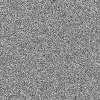
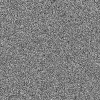
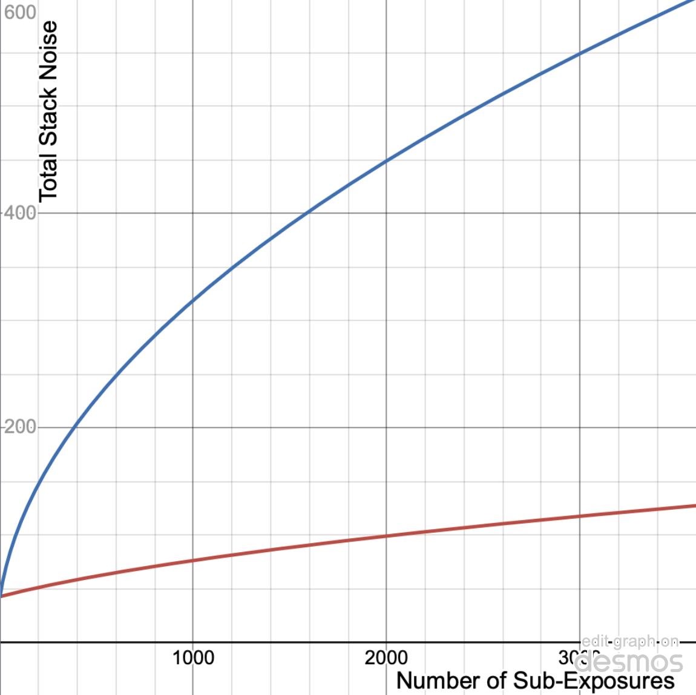
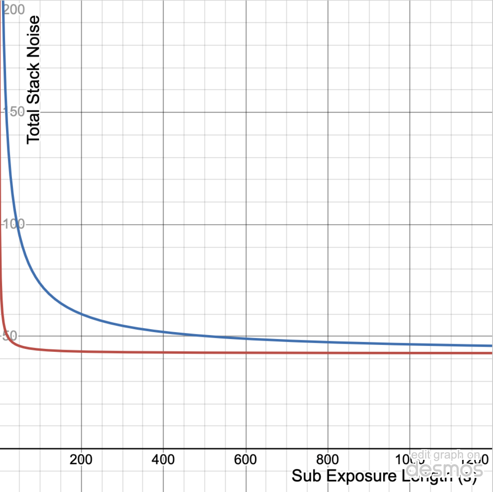
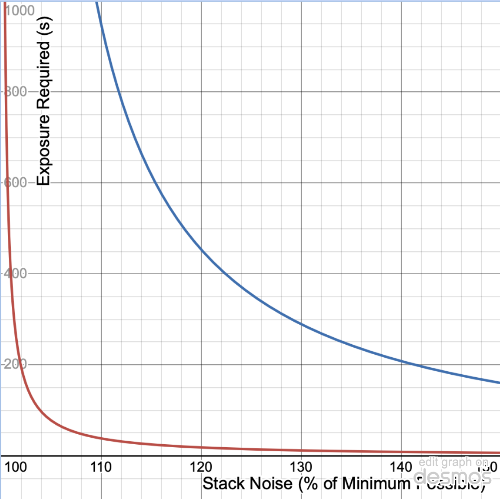

# Picking the correct exposure for Deep Sky

Original content by [Robin Glover](https://forums.sharpcap.co.uk/viewtopic.php?t=456), here reformatted in markdown.

## Formulating the Problem

Let's set out the goal to begin with, which is to answer this question:

> What is the best exposure for me to use when taking Deep Sky Images?

Actually, the question is actually a good deal longer than that - something more
like

> Given that I'm using camera $X$ with telescope $Y$ and that my light pollution
> levels are **insert value**, and that I have a total time available of **so
> many** hours before dawn/clouds arrive/my target goes behind a tree/having to
> pack up, what exposure length should I pick for my sub-exposures to give me
> the best possible image quality in the final stacked image I am going to
> produce?

The danger here is that a new (or even an experienced) imager will follow the
reasoning that if long exposures are needed to see faint things then even longer
exposures must be better. This view is perpetuated to a degree by discussions of
10,15 or even 20 minute sub exposures being used with guiding and high quality
mounts. These techniques of extremely long sub-exposures do produce good results
(providing the mount and guiding behave well), but as we will see they are not
always the only way to get good results with deep sky imaging.

In many conditions we will find that a law of diminishing returns applies as you
increase exposure length, meaning that exceptionally long exposures really give
no improvement in final image quality over the results that can be achieved by
dividing the same total exposure time into more, but shorter, sub-exposures.
Since long exposures have drawbacks of their own - guiding requirements, hot
pixels, satellite, meteor and plane tracks, etc, the key is obviously to find
the point at which the returns of increasing exposure diminish and choose that
point as our exposure time. By the end of this article we will have seen how and
why this point of diminishing returns arises and how you can find the exact
exposure needed to hit it using the new Smart Histogram functionality in
SharpCap 3.1.

To get started, we need to look at the causes of "noise" in a digital image and
how that affects the faint detail that we hope to see.

## Noise and Background

The trouble with the word "noise" (and the reason I am using it in quotes) is
that it gets used to cover two different concepts in imaging that really should
have different labels - these concepts are

**Random Noise** - this means random variations between pixel values in a single
frame (or between the value at a single pixel in sequential frames). These
random variations occur even when you are taking images of (for instance) a
perfectly flatly illuminated grey surface - not every pixel will have the value
of 50%, some will be 49%, some 51%, a few 48% and 52%. We'll come back to the
causes of these variations in a minute.

**Background Signal** - this means extra signal that is added to image the
information that you really want. The information you really want is pictures of
galaxies, nebulae, etc. The background signal comes primarily from sky glow
(sometimes called sky noise) and a thermal background caused by the temperature
of the camera sensor (sometimes thermal noise). We're not going to refer to
either of these effects as noise here to avoid confusion, but it turns out that
both of them can lead to random noise and that turns out to be critical to
understanding what exposure to choose.

Ok, that will do for post one - we've introduced the problem and made sure our
naming is clear, in the next section we will cover sources of random noise.

## Random Noise

Let's talk for a moment about how a digital imaging sensor works...

Photons (which have been collected by your telescope or camera lens) hit one of
the pixels on the sensor and each photon that hits the sensor has a chance of
being detected. Being detected means that the photon has managed to transfer an
electron into the charge well in the pixel and it is the number of these
electrons collected in each pixel that eventually gets turned into the image
that we view. The chance of a photon being detected is called the Quantum
Efficiency of the sensor, and for modern camera sensors it can be 40-50% or even
higher. Traditional photographic film only detected just a few percent of the
photons that fell on it, which explains why digital imaging has transformed
astrophotography so much!

Just to complete the picture of how we get the image out of our camera, once the
exposure is finished, the camera measures the number of electrons generated each
pixel, first as a voltage and then, using an analogue-to-digital-converter (ADC)
as a number. Depending on the imaging sensor and its configuration the final
number (which is measured in ADU) might be in the range 0..255, 0..4095 or
0..65535 or even other possible ranges.

So, let's imagine a fairly typical camera sensor (a CMOS or a CCD) and a fairly
typical imaging telescope - perhaps an ED refractor or similar that we are going
to use together for deep sky imaging.

Now, let's put our imaginary camera sensor onto an imaginary telescope and point
it at an imaginary M31. Think about one particular pixel on our sensor - maybe
it's one that's collecting light from one of the spiral arms of the galaxy -
suppose that on average 10 photons per second from M31 are hitting that
particular pixel on the sensor. If our sensor has a typical 50% quantum
efficiency then that pixel will be adding an average of 5 electrons per second
during the length of the exposure. If we took a 10s exposure we'd expect to
collect about 50 electrons, a 20s exposure about 100 and a 60s exposure about
300.

The key thing here is that our pixel will not collect 300 electrons every time
we take a 60s exposure - sometimes it will collect more, sometimes less because
the rate of 10 photons per second is only an average. It's like tossing a coin -
on average if you toss a coin 10 times you get five heads, but you don't get
five heads *every* time you do 10 coin tosses. This type of noise - caused by
random variations in the number of electrons detected for pixels that are
illuminated with the same intensity - is often called shot noise.

Now, it turns out that the random part of the number of electrons (ie by how
much it is likely to be over or under the average value) can be modelled by a
fairly simple and well known probability distribution called the [Poisson
Distribution](https://en.wikipedia.org/wiki/Poisson_distribution). You can read
the whole wikipedia article on it if you want, but the key fact that we need to
know is that the size of the random variation is equal to the square root of the
number of electrons, ie

$$
    \sigma_e = \sqrt{n_e}
$$

where $n_e$ is the number of electrons collected by the pixel and $\sigma_e$ is
the [standard deviation](https://en.wikipedia.org/wiki/Standard_deviation) of
the number of electrons expected between pixels all exposed to the same light
intensity.

To give a concrete example, in our 60s exposure case we would expect the number
of electrons to be 300, so the standard deviation will be the square root of
300, or about 17. That means that if we had a lot of pixels all with the same
light intensity falling on them, we'd expect about 68% of those pixels to have
values between 283 and 317 (within 1 standard deviation of the mean), about 95%
of them to be between 266 and 334 (within two standard deviations) and almost
all of them (99.7%) to be within 3 standard deviations.

So, now we understand where random noise in images comes from, and we have
probably all seen it as speckles particularly visible in the fainter portions of
an image. Before moving on, we need to see how that random noise limits our
ability to see faint detail in our images.

Back to our imaginary camera... We started by considering an area where the
pixels were receiving an average of 10 photons per second, which gave use 300
photons on average within 60s, but with random noise meaning that actually
values ranged from 266 to 334 and beyond. Now let's think about a different
region of spiral arm nearby that is a bit dimmer - say 10% dimmer. That would
lead to 9 photons per pixel per second on average and therefore an average of
270 photons in a 60s exposure with a standard deviation of about 16, so a
typical range of 238 to 302.

You can see the sort of noise that would arise from these situations in the
images below - while it's not too hard to see the differences between them when
the images are 100 pixels on a side each, if the brightness variation was part
of fine detail of an image it would be very easy for it to vanish completely due
to the level of noise.

Ok, enough on random noise (or at least shot noise) for now. In the next part
we'll see how the background signal arises and how it makes shot noise even
worse. After that we'll consider the other source of random noise - read noise.

## Background Signal

We've already mentioned that there are two main sources of background signal
(that is sources of detected electrons that don't come from the faint fuzzies
that we are hoping to image). Those sources are

* Light pollution background
* Thermal background

The light pollution one is fairly simple to understand - excess light from
street lighting, security lights, the moon, etc is scattered by the atmosphere
and some of those extra photons end up coming down our telescope and hitting our
imaging sensor. There's nothing special or different about these photons (aside
from the fact that we don't really want them). When they hit the pixels in the
imaging sensor they have a chance of generating an electron that is given by the
camera's quantum efficiency, just like any other photon.

The thermal background comes from electrons that are generated by heat in the
camera sensor instead of by photons. All the atoms in the sensor are vibrating
and sometimes those vibrations can knock an electron into the measurement well
just like a photon does.

Now, once those background electrons have been generated, it doesn't matter
which source they came from - it's impossible to tell an electron generated by
thermal vibrations from one generated by sky glow from another that was
generated by a photon that's spent a few million years travelling here from
M31... All those electrons get collected by the pixel and eventually measured at
the end of the exposure to give an ADU value for that pixel.

So, just as our imaginary pixel in the last part was receiving 10 photons per
second from M31, it will also receive photons from the sky glow at some rate and
electrons from thermal effects at a particular rate too. So, we can write down
an equation like this

$$
    n_e = t(Qr_{p,\mathit{target}} + Qr_{p,\mathit{sky}} + r_{e,\mathit{termal}})
$$

That is that the number of electrons collected by a pixel in an exposure is
given by the length of the exposure multiplied by the sum of the photon rate
from the target times the sensor QE, the photon rate from the sky times the
sensor QE and the electron rate from thermal sources.

Using our previous example values of 60s for t, 10 for $r_{p,\mathit{target}}$
and 50% for $Q$, and picking 5 for $r_{p,\mathit{sky}}$ and 1 for
$r_{e,\mathit{thermal}}$, we can calculate a total number of electrons collected
in a 60s exposure including the effect of light pollution and thermal background
to be 510. Remember that the number of electrons that came from our target was
300, so we have added a background level of an extra 210 electrons to this
pixel, which will be reflected in higher ADU readout values.

If the only thing that sky background and thermal background did was to add a
constant offset to all the pixels in the image then they wouldn't worry us much
-- we could just subtract dark frames and fix the problem completely in
processing. Unfortunately it doesn't work like that... Now we are collecting 510
electrons in our pixel instead of 300, so we have to revisit our shot noise
calculations. For 300 electrons, our shot noise standard deviation was about 17
electrons, or about 5.5% of the signal. Now we have 510 electrons, the shot
noise increases to nearly 23 electrons, or about 7.7% of the original signal of
300 electrons that came from our target.

In this part we've learnt how the background from light pollution and thermal
sources not only add on a constant brightness level to our images but also
increase the noise levels making fine detail hard to see. We've also seen that
when we are thinking from the point of view of detected electrons we don't
really care whether the background was due to heat or light pollution - they
both have the same effect.

In the next part we're going to talk about the final part of the noise picture -
read noise - and how all the parts fit together.

## Read Noise

Once the exposure is completed, the camera measures the voltage for each pixel
using an ADC (analogue to digital converter). In CMOS cameras there is an ADC on
each pixel, so the readout is very quick, wherease in CCD cameras the charge is
moved accross the rows of pixels in the camera to a single ADC, leading to
slower readout times. Whichever way the readout happens, it's unfortunately not
100% accurate - this inaccuracy is referred to as Read Noise.

Read Noise means that the digital value we get out of a pixel doesn't exactly
equate to the number of electrons that were collected by that pixel and that the
value will vary even between pixels that have collected exactly the same number
of electrons. The read noise of a camera is usually measured in terms of the
standard deviation the final image ADU values converted back from ADU
measurements to electrons - that is a camera might have a read noise of 3e or
8e.

Modern CMOS cameras can have read noise values as low as 1e, although 2e-3e are
more typical. Older CMOS cameras may have read noise values of up to 7-8e.
Almost all CMOS cameras have a gain control that can be adjusted (the gain acts
as a pre-multiplier for the pixel voltage before it is passed to the ADC, so
that when the gain is increase you get a bigger increment in ADU for a single
extra electron). Usually CMOS cameras show a smaller read noise as the gain is
increased, although the drop in read noise usually quickly levels off. CMOS
cameras typically have a very large effective read noise in 8 bit mode - this is
because it may take 50 or 100 or even more extra electrons to move up to the
next 8 bit ADU level.

CCD cameras usually do not have a variable gain and tend to exhibit higher read
noises in the 7e to 10e range.

Read noise levels are usually unaffected by anything other than changes to the
camera gain. Temperature, exposure length and other adjustments do not have a
significant effect on them.

## Adding Noise

This is where it starts to get interesting. Let's go back to an examples we've
looked at before - our 60s exposure with sky background and thermal background
from part 3 and add in the effect of read noise. We calculated a total of 510
electrons being accumulated during the 60s exposure, giving a shot noise level
of $\sqrt{510}$ or about 22.6e. Let's also assume we are using a modern CMOS
camera with a read noise of 2.5e. How do those two noise levels get combined to
calculate the final noise level of the pixel?

You might be tempted to just add the two noise values to get 25.1e, but this
isn't the right approach (and if it was then we'd come to some very different
conclusions about how to take deep sky photos at the end of this series of
posts...). It turns out that the right way to add two or more sources of noise
is as follows

$$
    N_{\mathit{tot}} = \sqrt{
        N_1^2 + N_2^2 + N_3^2 + \cdots
    }
$$

That is, each individual source of noise is squared, the squared noises are
added together and then the square root of that sum gives the total noise. This
is called 'adding in quadrature' and strictly speaking we need to be sure that
the different sources of noise are statistically independent from each other
before using this approach.

Let's see what total noise we get by adding our two noise sources (2.5e and
22.6e) in quadrature

$$
    \sqrt{22.6^2 + 2.5^2} =
    \sqrt{510 + 6.25} =
    \sqrt{516.25} =
    22.7
$$

Ok, that might be a surprising result to some of you - we added an extra noise
of 2.5e onto our 22.6e shot noise and the total was 22.7e, hardly any change at
all. This effect - the fact that when you add sources of noise the smaller
source contributes very very little to the total noise - is the key to being
able to choose a good exposure length for deep sky astrophotography, but we
aren't quite ready to use it yet.

Before we move on, let's re-do our calculations for a couple more cases. First,
based on the same shot noise level (ie same target brightness, sky background
and thermal background), but for a CCD camera with a read noise of 8e. In this
case, the total noise will be

$$
    \sqrt{22.6^2 + 8^2} = \sqrt{510+64} = \sqrt{576} = 24.0
$$

In this case you can see that the camera read noise has at least had an
appreciably effect on the total noise, raising it by about 6% above the shot
noise level to 24.

For our last example, we will continue to use our CCD camera with 8e read noise,
but will change to a 6s exposure, which will reduce the number of electrons
collected from 510 to about 51, leading to a shot noise of about 7.1e.

$$
    \sqrt{7.1^2+8^2} = \sqrt{51+64} = \sqrt{115} = 10.7
$$

The conclusion we need to take from this section is that when the read noise is
much less than the shot noise then the read noise has virtually no effect on the
total noise, which will be very close to the shot noise value. This is because
the noise needs to be added in quadrature.

## Putting it all together

Armed with our new knowledge of how to calculate image noise, let's go back to
try to work out the answer to our original question from part 1 - that is what
is the best sub-exposure length to use when imaging under particular conditions.
Unfortunately this part is going to be rather heavy on the mathematics - if you
want, you can take the maths on trust and skip on to what it all means for deep
sky exposure times in part 7.

We need to set out the problem more thorougly as follows:

Assume we are using a camera of quantum efficiency $Q$ and read noise $\sigma_r$
electrons that produces thermal background at a rate of $r_{e,\mathit{thermal}}$
electrons per pixel per second.

Assume also that the light pollution level leads to $r_{p,\mathit{sky}}$ photons
per pixel per second.

We intend to image for a total time of $T$ seconds and we will divide that time
into $n$ separate sub exposures each of duration $t$ seconds, where $T=tn$.

What we need to do now is to work out the total noise level of the final stack
of n images that we will have at the end of our imaging session. The lower the
total noise level of that final stacked image, the better our final image will
look and the more faint detail we will be able to see. In fact we will calculate
the noise of the darkest parts of the image where the only signal comes from the
thermal background and the sky background - this will be the lowest noise of any
part of the image as brighter parts will have higher electron counts and
therefore more shot noise.

To begin, let's work out the noise of a single sub-exposure. From part 3, we
have

$$
    n_e=t(Qr_{p,\mathit{target}}+Qr_{p,\mathit{sky}}+r_{e,\mathit{thermal}})
$$

but, in this case we are considering a dark part of the image, so there are no photons from the target. So, using the fact that the standard deviation of the shot noise is the square root of the number of electrons, we have

$$
    \text{shot noise} = \sigma_e = \sqrt{t(Qr_{p,\mathit{sky}}+r_{e,\mathit{thermal}})}
$$

We have assumed that we have measured the read noise of the sensor to be
$\sigma_r$, so we can use the rule of adding in quadrature to get the total
noise for the frame

$$
    \sigma_{\mathit{frame}} = \sqrt{\sigma_r^2+\sigma_e^2}
$$

At this point we will assume (subject to further discussion later) that the
thermal noise is much smaller than the sky noise, so we can ignore the thermal
noise for now. Substituting in our calculation for the shot noise, we have.

$$
    \sigma_{\mathit{frame}} = \sqrt{\sigma_r^2 + \left(\sqrt{tQr_{p,\mathit{sky}}}\right)^2}
$$

Now, obviously we are taking the square root of the electron count from sky
noise and then immediately squaring it again, getting us back where we started,
which means we can simplify the frame noise value to

$$
    \sigma_{\mathit{frame}} = \sqrt{\sigma_r^2 + tQr_{p,\mathit{sky}}}
$$

Phew - we now have a value for the noise in a single frame, let's see how we can
go from there to the noise in our final stack of $n$ frames.

We will make our final stacked image by adding all the sub frames. This gives us
a clue as to how to calculate the noise - we already know how to combine noise
figures together in this sort of case - we add them in quadrature. That gives us
a noise figure for our final stacked frame of

$$
    \sigma_{\mathit{stack}} = \sqrt{
        \sigma_{\mathit{frame}}^2 +
        \sigma_{\mathit{frame}}^2 +
        \cdots
    }
$$

The total number of frame noises that we are adding inside the square root will
be equal to $n$, the number of sub-frames, so

$$
    \sigma_{\mathit{stack}} = \sqrt{n \cdot \sigma_{\mathit{frame}}^2} =
    \sqrt{n(\sigma_r^2 + tQr_{p,\mathit{sky}})}
$$

Remembering that the number of sub-exposures times the sub-exposure length gives
the total time $T$, we finally have

$$
    \sigma_{\mathit{stack}} =
    \sqrt{n \cdot \sigma_r^2 + TQr_{p, \mathit{sky}}}
$$

In the next section we will at last see what this equation tells us about
choosing our sub-exposure length.

## What does it all mean?

So, in the last part, we at last derived a formula that gave us the total amount
of noise in a stack of images

$$
    \sigma_{\mathit{stack}} =
    \sqrt{n \cdot \sigma_r^2 + TQr_{p, \mathit{sky}}}
$$

Let's remind ourselves of the variables in this equation:

* $T$ - the total time we intend to image for
* $n$ - the number of sub-exposures we intend to take in our total imaging time
* $\sigma_r$ - the read noise of the camera - typically between 2 and 10 electrons
* $Q$ - the quantum efficiency of the camera - typically about 50% (ie 0.5)
* $r_{p,\mathit{sky}}$ - the sky background (light pollution) photon rate in
  photons per pixel per second

We have two terms inside the square root sign in this equation. The first, $n
\cdot \sigma_r^2$, represents the contribution of the read noise to the final
stack noise while the second, $TQr_{p, \mathit{sky}}$, represents the
contribution of the shot noise to the final stack noise. It's also worth noting
that the second term inside the square root - $TQr_{p, \mathit{sky}}$ - is
actually equal to the number of electrons detected per pixel over the entire
time $T$ of the imaging session. This number will typically be in the 100s or
1000s.

Let's have a look at what sort of values this equation gives us.

This graph shows how the total stack noise varies with the number of sub
exposures. For this I have taken a total imaging time of 1 hour (3600 seconds),
a sensor QE of 50% and a sky photon rate of 1 photon per pixel per second. The
red line shows the curve for a sensor with read noise of 2e and the blue line
shows the curve for a read noise of 10e. Both meet at the point where we take
only 1 sub-exposure of 3600s duration (where the read noise is basically
negligible in both cases). It's clear from this how much the higher read noise
impacts the image quality when we use shorter sub-exposures.

If we re-draw the graph so that it shows the same data but in terms of
sub-exposure time on the x-axis instead of sub-frame count, it's a lot more
striking

Somewhere way out to the right hand side we can reach a total stack noise of
about 42 by taking a single one hour exposure. Our 2e read noise camera can
reach a stack noise of about 45 at 60s sub-exposures, but the 10e read noise
camera has about double the total noise at that sub-exposure length and can't
get down to a stack noise of 45 until the sub-exposure length hits 1200s (20
minutes) or more.

This last graph shows a very interesting thing - that the sub-exposure time
needed for deep sky imaging depends very strongly on the read noise of the
camera. High read noise cameras absolutely require very long exposures. Low read
noise cameras can get the same results by stacking more, but far shorter,
frames.

Ok, so now we have an outline of the answer to our question - next time we will
take the maths a little further and calculate some actual numbers for optimum
exposure times.

## Results

If we look at the second graph in part 7, we can see three main sections to the
curves

1. For very short exposures where the noise level rises very rapidly as the
   sub-exposure times become shorter and
2. Far out to the right hand side where the sub-exposures become long - out here
   the noise doesn't change much,
3. The bit in the middle where the graph curves

Let's think about our equation for stack noise

$$
    \sigma_{\mathit{stack}} =
    \sqrt{n \cdot \sigma_r^2 + TQr_{p, \mathit{sky}}}
$$

and how it applies in each of those three areas.

In area (1) where the sub-exposures are very short, $n$ is very large, which
means that the first term in the square root is much bigger than the second. In
this case we have

$$
    \sigma_{\mathit{stack}} \approx \sqrt{n \cdot \sigma_r^2} =
    \sqrt{\frac{T}{t} \cdot \sigma_r^2}
$$

So we see the stack noise rises rapidly being proportional to the square root of
the number of sub-exposures in this area.

In area (2) where the sub-exposures are long, $n$ is very small, which means
that we can start to ignore the first term inside the square root as it will be
much smaller than the second term. If the first term is much smaller than the
second term, we have

$$
    \sigma_{\mathit{stack}} \approx \sqrt{TQr_{p,\mathit{sky}}}
$$

which is telling us that when we get to the point where the first term can be
ignored, the stack noise no longer depends on the number of sub-exposures (or
the sub-exposure length) at all. (see Note 1)

This is a key result - it tells us that there is a point where making the
sub-exposures longer has no further effect on improving image quality. If you
are already past that point then going from a 5 minute sub exposure to a 10 or
even 20 minute sub exposure will **not** improve the quality of your final
stacked image at all. In fact it will probably make it worse as you are risking
guiding errors and tracking errors and loosing out on dynamic range.

The final question to be answered is - what is the magic exposure length that we
need to use to get good results in the final stack without entering the zone
where longer exposures give us practically no improvement. We can see from the
graphs above that there is always a slight extra improvement in stack noise by
going to longer sub-exposures, but that the improvement quickly becomes very
very slow (especially with low read noise cameras!). In order to get a number,
we have to decide how much extra noise are we prepared to tolerate, over and
above the minimum possible noise that we would get with very long sub-exposures.

The minimum possible noise, with no contribution from read noise, is

$$
    \sigma_{\mathit{stack},\mathit{min}} =
    \sqrt{TQr_{p,\mathit{sky}}}
$$

If we are prepared to accept (say) a stack noise value that is 5% higher than
this, we have

$$
    \sigma_{\mathit{stack}} =
    \sqrt{n \cdot \sigma_r^2 + TQr_{p,\mathit{sky}}} =
    1.05\sigma_{\mathit{stack},\mathit{min}} =
    1.05\sqrt{TQr_{p,\mathit{sky}}}
$$

Squaring both sides, we have

$$
    n \cdot \sigma_r^2 + TQr_{p,\mathit{sky}} =
    1.05^2TQr_{p,\mathit{sky}}
$$

so

$$
    n \cdot \sigma_r^2 = (1.05^2 - 1)TQr_{p,\mathit{sky}}
$$

Now, what we are actually interested in is the exposure time $t=T/n$, so we can
re-arrange and finally get

$$
    t = \frac{T}{n} =
    \frac{1}{1.05^2 - 1}
    \frac{\sigma_r^2}{Qr_{p,\mathit{sky}}}
$$

Let's look at that equation and see what we can learn from it:

1. **The optimal sub-exposure time is proportional to read noise squared!** That
   means that a read noise 10 camera needs to use exposures 25 times longer than
   a read noise 2 camera to get to the same stack noise level. This explains at
   a stroke why extremely long sub-exposures have become common in deep sky
   imaging - it's because high read noise CCD cameras need them! It also makes
   it clear that if you have a low read noise camera and you use those very long
   exposures then you are still paying the price for a problem you don't have to
   solve!
2. **There is a factor at the front of the formula that depends on the amount of
   extra noise we were prepared to accept.** For our value of 5% the factor
   $\frac{1}{1.05^2-1}$ works out to be about 9.75. If we were prepared to accept
   10% extra noise then it's 4.76. If we were fussy and only wanted to add 1%
   extra noise then it's 49.75. Remember that moving from 5% extra noise to 1%
   isn't reducing the noise by a factor of five, it's reducing it from 105 to
   101. Is that worth it for the price of making your sub-exposures five times
   longer? Probably not!
3. **The optimal exposure is inversely proportional to both the QE of the camera
   and the sky background brightness (light pollution).** Worse light pollution
   means shorter sub exposures. We know this instinctively because if you take
   very long exposures with bad light pollution then your subs wash out to a sea
   of white - you have to keep the histogram level down to a reasonable point by
   limiting the exposure length. In terms of the equation, more light pollution
   means that the number of electrons (and hence the amount of shot noise) we
   need to be much bigger than the read noise is reached more rapidly.

One last chart - this shows the result of our equation for the 2e read noise
camera (red) and 10e camera (blue). Here we are looking at the total allowed
noise level on the x axis (in %, with the minimum achievable noise being 100%)
and the sub-exposure lengths needed to meet that noise level on the vertical
axis.

Again, it's striking how much effect the different read noise values have on the
exposure times!

To finish off, let's put some numbers into our equation to calculate optimal
exposure times for our two cameras we drew graphs for earlier. Using the same QE
of 50% and sky photon rate of 1 per pixel per second, and allowing a 5% increase
from the minimum noise level, we obtain the following exposures:

* 10e read noise camera: 1951s (32.5 minutes)
* 2e read noise camera: 78s

If we allow a 10% increase in noise level, we get instead

* 10e read noise camera: 952s (15.8 minutes)
* 2e read noise camera: 38s

Finally, considering a more light polluted area with 5 photons per pixel per
second, still at 10% noise allowance

* 10e read noise camera: 190s
* 2e read noise camera: 7.6s

Of course, if you don't fancy doing these calculations in the dark and cold
every time you observe, then just check out the Smart Hisogram functionality in
SharpCap 3.1 - The Smart Histogram 'Brain' window will run these calculations
automatically for you (and more) and suggest optimal gain and exposure values
for your observiing conditions!

### Note 1

If you are observant you may have noticed that the equation

$$
    \sigma_{\mathit{stack}} \approx
    \sqrt{
        TQr_{p,\mathit{sky}}
    }
$$

gives a total stack noise that is proportional to the square root of the total
observation time $T$. This means that the noise gets bigger as the total
exposure time goes up, which seems wrong! However, remember that the signal we
are wanting to see -- the galaxy or nebula -- will have a strength that is
proprtional to the total observation time $T$ itself (not its square root), so
the signal will be going up even faster. In fact, the signal-to-noise ratio,
which is the key factor for determining if something is visible or not, will
turn out to be proportional square root of $T$, so will go up as the total
observation time increases, which is what we would expect.
