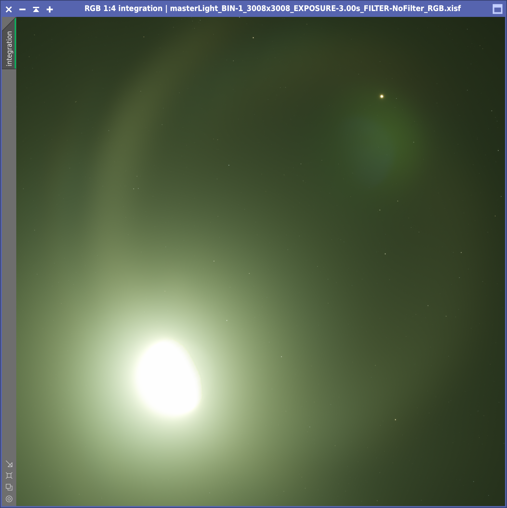
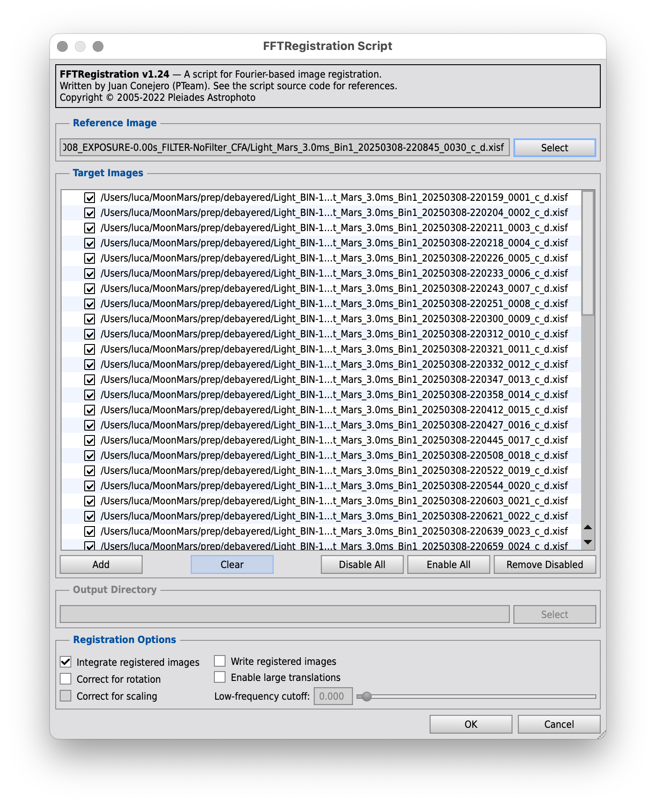
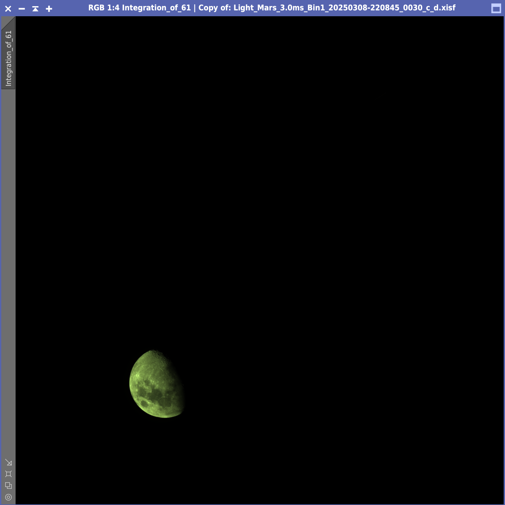
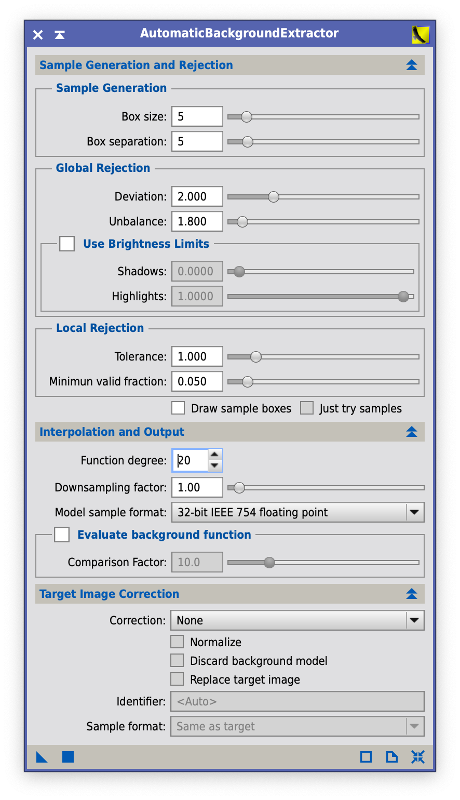
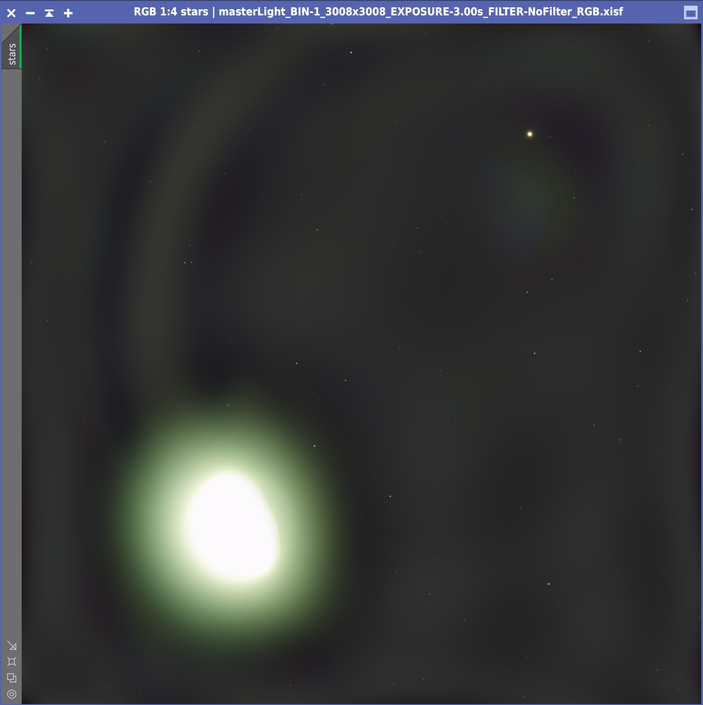
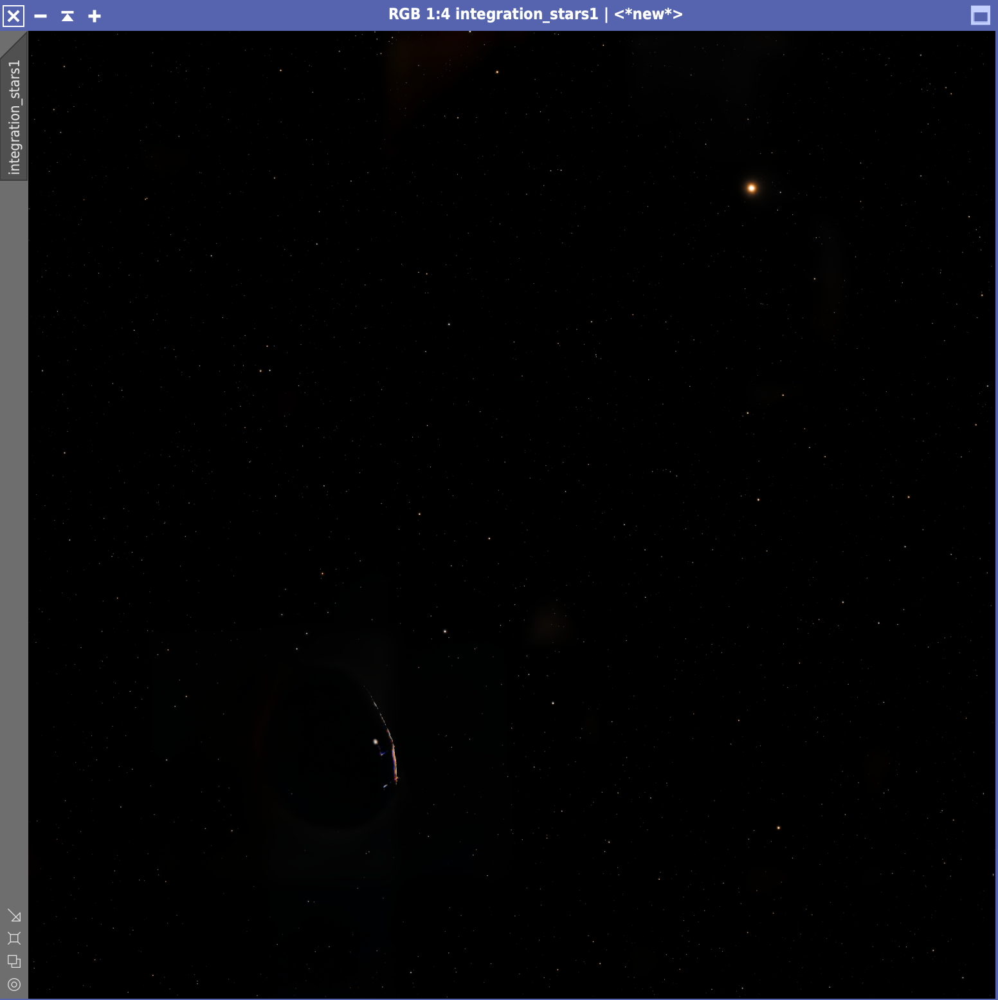

# The March 2025 Moon-Mars Conjunction

On 8 March 2025 at around 22:00 the moon and Mars were close enough to fit
inside the sensor of the ASI533MC Pro connected to my Askar FMA180 Pro. I wanted
to try capturing a moon/planet conjunction, knowing that the moon's brightness
would have made things quite difficult. During the imaging session I captured

* 60x3s light frames
* 60x3ms light frames
* 50x1.28s flat frames
* 50x1.28s dark frames

## Preprocessing

I use WBPP to process and stack all these files, lowering both the calibration
exposure tolerance and the post-calibration exposure tolerance to 0 so that
PixInsight would not try stacking all light frames together. Stacking fails for
the 3ms light frames, likely because of the lack of stars (Mars and the Moon
were crossing Gemini, in a region with relatively few bright stars). The point
of throwing the 3ms lights to WBPP is only to obtain the debayered files
automatically, which I can stack later on with FFTRegistration.

The brightness of the moon (possibly along with some humidity in the air) causes
a huge halo which is going to be difficult to remove.

## Moon stacking

In order to stack the moon from the 3ms light frames, I use FFTRegistratio. I
add the debayered frames created by WBPP and select the 30th frame as reference
frame. In this way, the resulting moon is roughly half way from the start to the
end of the imaging session. There's no need to specify an output directory,
since all I want is the stacked image (make sure that "Integrate registered
images" is checked).

Both stacked images have a green cast that is likely due to the Astronomik UV-IR
filter I used while capturing frames.

## Dealing with the background of the star field

First of all I try to reduce the halo by running ADBE. Given that the halo has a
very irregular shape, I raise the function degree to 20, increase deviation to 2
and lower the downsampling factor to 1. With such a high degree function
PixInsight takes a while to compute the background model, but eventually it's
done.

The result is not perfect, but I'm not too worried since I'm going to use just
the stars from this image.

## RC Astro

Next I run BlurXterminato and NoiseXterminator as I were processing a plain
nebula photo. In BlurXterminator I disable nonstellar sharpening to reduce any
artifact that deconvolution may introduce and that may later be mistaken for a
star. Finally, I run StarXterminator **twice** to remove the stars. I have to
run StarXterminator twice because the first run weirdly leaves some traces of
the halo, whereas in two runs it's almost completely gone. There are some
artifacts around the moon, but I can remove those with CloneStamp.

