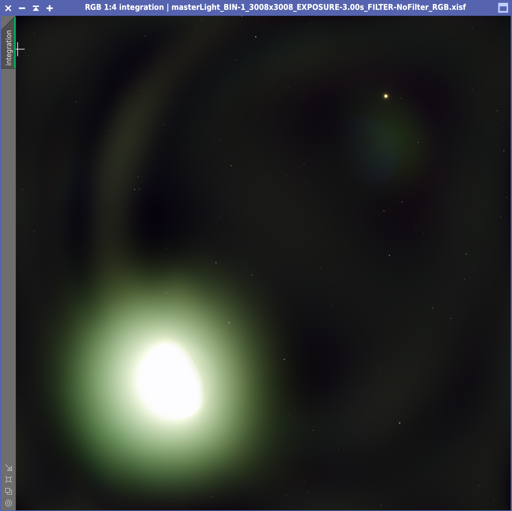
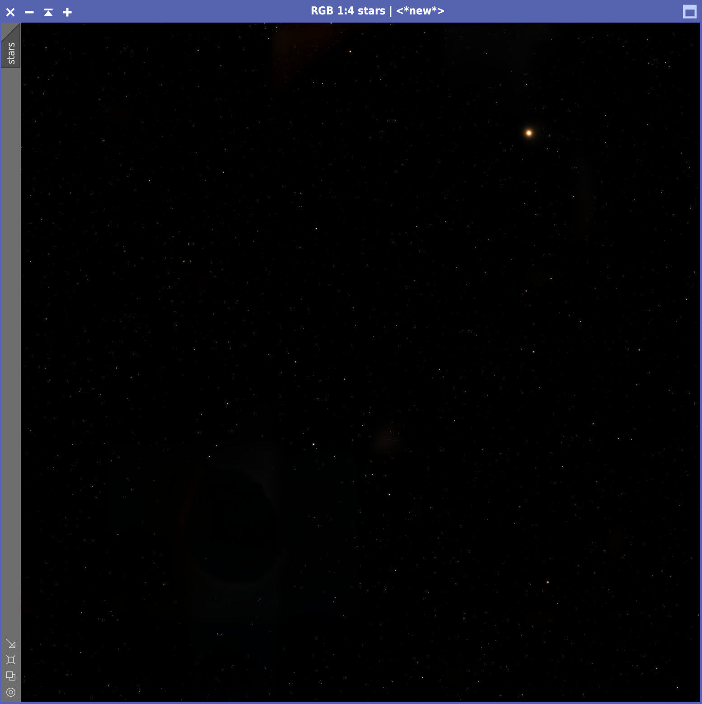
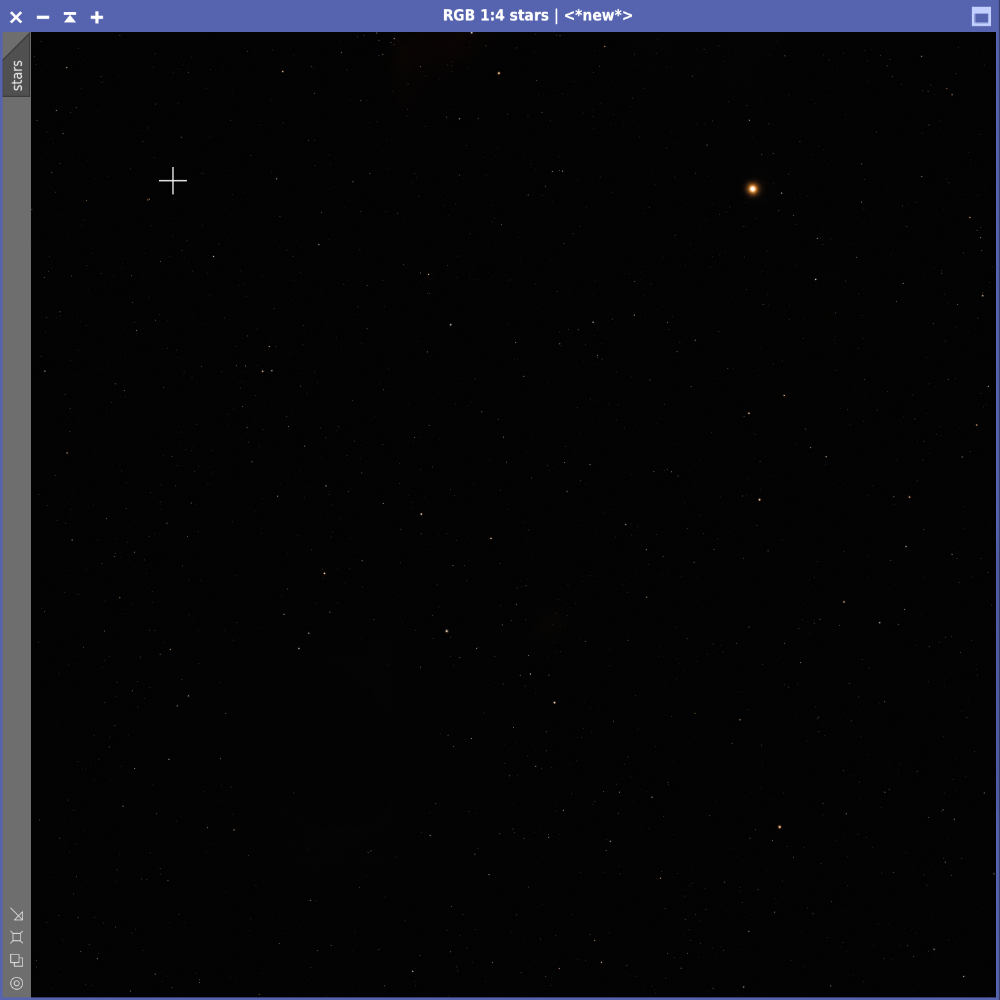
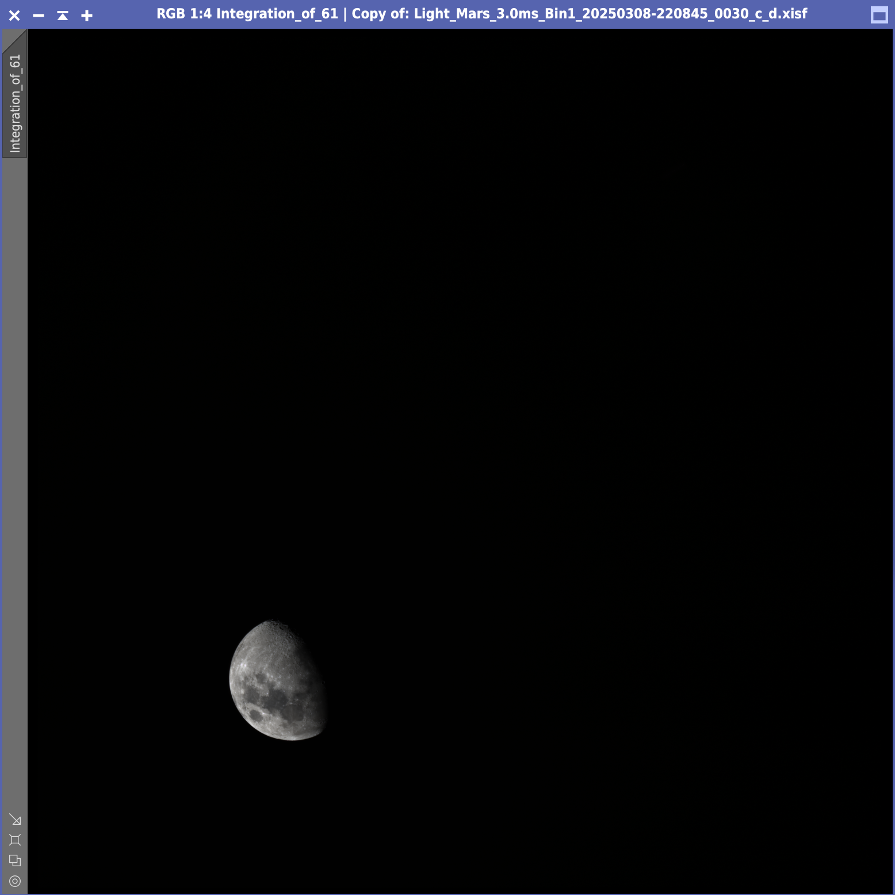
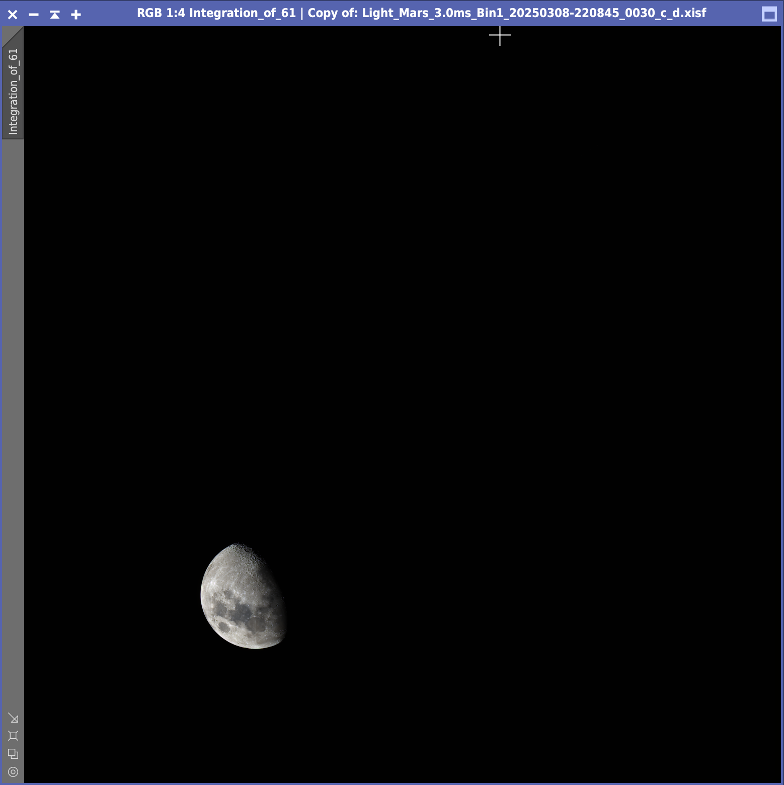
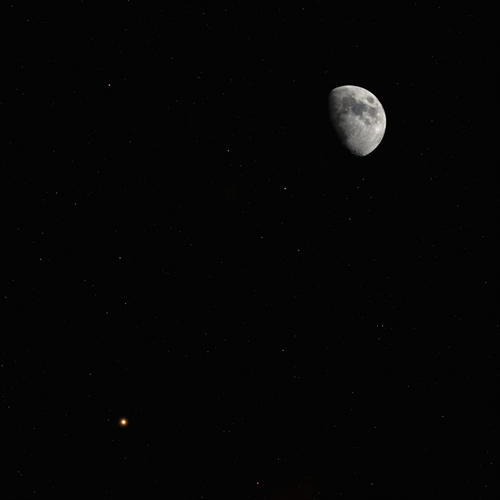
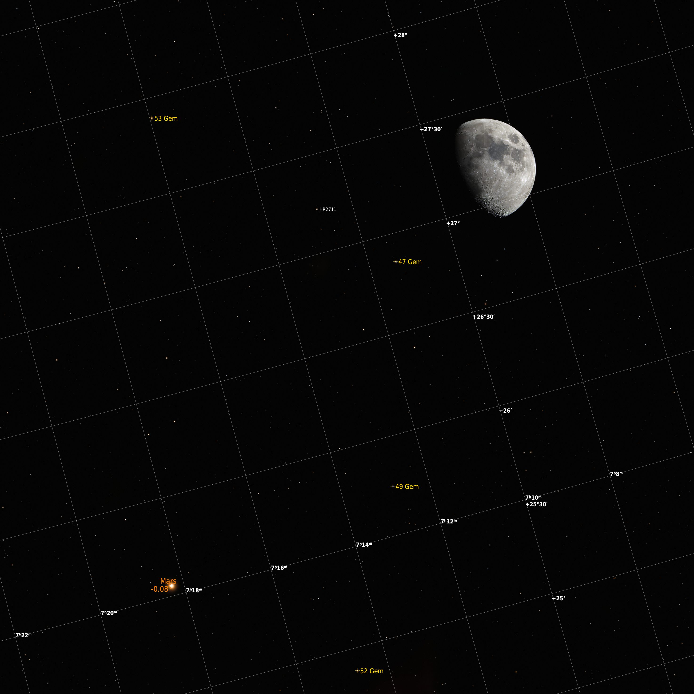

# The March 2025 Moon-Mars Conjunction

On 8 March 2025 at around 22:00 the moon and Mars were close enough to fit
inside the sensor of the ASI533MC Pro connected to my Askar FMA180 Pro. I wanted
to try capturing a moon/planet conjunction, knowing that the moon's brightness
would have made things quite difficult. During the imaging session I captured

* 60x3s light frames
* 60x3ms light frames
* 50x1.28s flat frames
* 50x1.28s dark frames

using an Astronomik UV-IR cut filter.

## Preprocessing

I use WBPP to process and stack all these files, lowering both the calibration
exposure tolerance and the post-calibration exposure tolerance to 0 so that
PixInsight would not try stacking all light frames together. Stacking fails for
the 3ms light frames, likely because of the lack of stars (Mars and the Moon
were crossing Gemini, in a region with relatively few bright stars). The point
of throwing the 3ms lights to WBPP is only to obtain the debayered files
automatically, which I can stack later on with FFTRegistration.

The brightness of the moon (possibly along with some humidity in the air) causes
a huge halo which is going to be difficult to remove.

## Moon stacking

In order to stack the moon from the 3ms light frames, I use FFTRegistratio. I
add the debayered frames created by WBPP and select the 30th frame as reference
frame. In this way, the resulting moon is roughly half way from the start to the
end of the imaging session. There's no need to specify an output directory,
since all I want is the stacked image (make sure that "Integrate registered
images" is checked).

Both stacked images have a green cast that is likely due to the Astronomik UV-IR
filter I used while capturing frames.

## Post-processing the star field

First of all I try to reduce the halo by running ABE. Given that the halo has a
very irregular shape, I raise the function degree to **11**. It took a lot of
trial and error to find the degree that results in the "best" star field, the
one that leads to the least amount of artifacts later on. The result is still
not perfect, but I'm not too worried since I'm going to use just the stars from
this image.

Next I run BlurXterminator as if I were processing a plain nebula photo, but I'm
only interested in reducing stars (and Mars) so I disable nonstellar sharpening.
This also reduces any artifact that deconvolution may introduce and that may
later be mistaken for a star. Then, I run StarXterminator to remove the stars.
There are some residual artifacts around the moon, but I can remove those with
CloneStamp. Finally, I use Set Astro's StarStretch to stretch the stars. I
decrease the stretch amount to 4 so as to reduce the amount of artifacts that
become visible after the stretching. Also, I prefer not to have the dimmest
stars visible. The point is that around the moon (where the bright halo was
strongest) there will invariably be a starless zone and if the rest of the sky
is packed with stars such zone will be very noticeable later on, once the moon
is inserted. So, I think it's better seeing fewer stars but with the illusion of
a more uniform star field across the whole image.

It's now time to get rid of the last moon artifacts using CloneStamp. I hate
using this tool, but there's no other way around the problem.

As I'm using CloneStamp, I realize that there's still a dim trace of the moon's
halo such that the hole left by the moon is barely noticeable. Since the moon
will not fill this hole entirely, I think it's better to darken the background.
To this aim, I create a star mark and use CurvesTransformation to clip the
background to 0. Then, I use SimplexNoise with amount 0.02 and scale 1 to
restore a minimal noisy background, so that it's not exactly black.

## Post-processing the moon

I use ColorCalibration to get rid of the green cast. To do so, I create two
previews in the moon stack, a small one surrounding a bright crater and a larger
one in the background. The result is a neutral moon.

I use CurvesTransformation to brighten the moon, being careful not to overexpose
the brightest craters. I also increase saturation in two steps, so that the moon
regains some color. Finally, I use BlurXterminator with default settings to
sharpen the details.

## Final image composition

I like ImageBlend to merge the moon and the starry background. Then I rotate the
image by 180 degrees and use DynamicCrop to remove a thin border of ~50 pixels
all around the border, where the FFTRegistration didn't have enough pixels to
integrate.

As a final step, I also generate an annotated version of the image. To that aim,
I need to plate solve the image again. ImageSolver needs to know that the star
**47 Gem** is in the picture. I also enter the exact date in which the images
were captured, as well as the focal length of the telescope (174mm) and the
pixel size (3.76). When using AnnotateImage it is important to check "Planets"
so that Mars is properly annotated.

