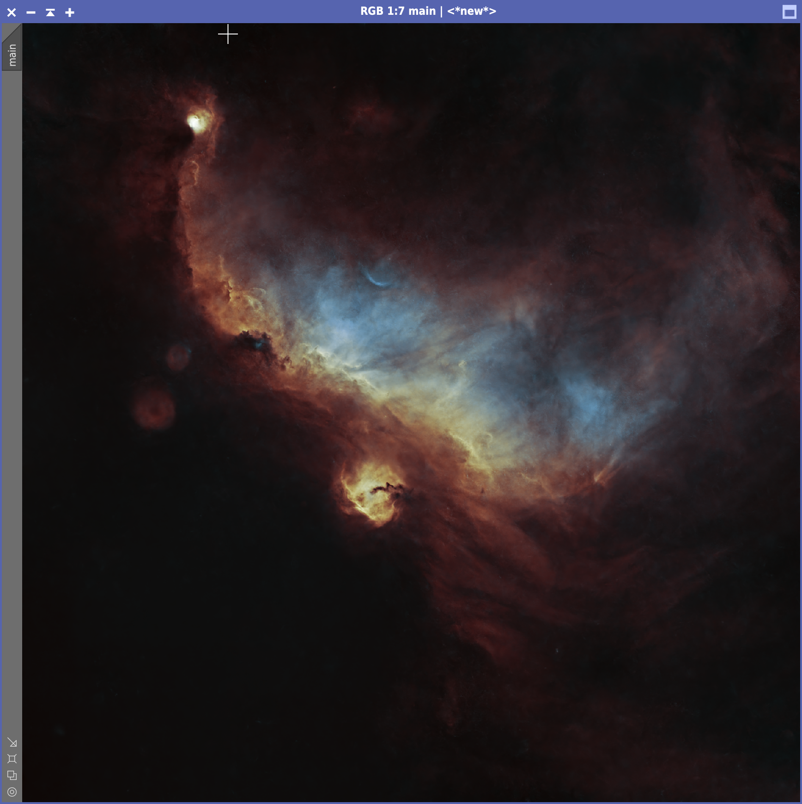

# Seagull Nebula (IC 2177)

March 2025

## Imaging sessions

At the beginning of March 2025 there was an extraordinary streak of clear
nights, no humidity and a young moon. I decided to take advantage of this week
to photograph what would probably have been the last nebula before summer time
(the balcony from which I'm shooting faces south and the galaxy season doesn't
offer much from that perspective).

1. 2025-03-02
2. 2025-03-03
3. 2025-03-04
4. 2025-03-05
5. 2025-03-06

Given the size of the target, I decided to use the Askar FMA180 Pro coupled with
the ASI533MC Pro and an Optolong L-ULTIMATE filter. The session resulted in:

* 287 x 300s light frames (barely under 24 hours)
* 50 x 4s flat frames
* 50 x 4s dark frames

## Preliminary processing

{:.aside .noshadow}

I cropped ~50px around the border to get rid of any stacking artifacts caused by
dithering. Since the telescope had been mounted the whole week, the framing was
exactly the same and there was no need to further crop the image.

The seagull nebula is relatively low at my latitude, which means that the
resulting image presents a fairly strong gradient due to light pollution. I
found that the **Automatic DBE** script by Seti Astro worked well on this
target, provided that I excluded all areas containing significant nebulosity.

I then applied [BlurXTerminator] (default settings) to reduce the stars and to
sharpen the nebulosity a little. I also rotated the image by 180° so that the
seagull would be flying up, which seemed to be more natural to me. I then used
[StarXTerminator] to separate the stars from the nebula and applied
[NoiseXTerminator] (default settings, denoise = 0.90 and 5 iterations) to the
nebula to get rid of the background noise.

## Post-processing of the nebula

{:.aside}

Having used a strong dual narrowband filter, for this target I chose to base my
stretching on the Foraxx palette. I had written a **PixelMath** equation myself
to convert an RGB image to the Foraxx palette, but that didn't seem to work well
for some reason. Therefore I used Set Astro's **Perfect Palette Picker**, I made
sure that linear input data was selected, and stretched my Hα+OIII image. This
script yields really good results, but unfortunately it is not possible to
control in any way the amount of stretching that it performs. In this case, I
found that it overstretched the image a bit too much, and the background turned
out to be too bright.

{:.aside}

I used **HistogramTransformation** to darken the image and get rid of the
largely useless pixels below the median. I ended up to clip slighly more than
1000 pixels, which was not a big issue. Even after that, the background was
still too bright, therefore I used **GHS** to further darken the image and at
the same time add some contrast (mode: RGB, stretch factor: 0.860, symmetry
point: 0.577825).

The picture was looking good, but I was hoping to emphasize the bluish region
under the wings of the seagull. Therefore I performed two more **GHS** stretches
on the green and blue channels only. The first one on the blue channel (stretch
factor: 0.6, local intensity: 0.75, symmetry point: 0.6) and the second one on
the green channel (stretch factor: 1.120, local intensity: 0, symmetry point:
0.5, protect highlights: 0.75). It took a **long** time to get these parameters
right, because colors tend to shift with further processing. Also, after you've
used **GHS** on one of the individual channels, the color balancing is way off
and it is not easy to understand whether the stretch is appropriate or not. It
would be great if **GHS** allowed to preview the effect of multiple stretches on
different channels (like **CurvesTrasformation** does), but I understand that
the interface would be cumbersome to conceive. After these stretches, I found
that the image was slightly too bright, so I applied a gentle curve on the
luminance with **CurvesTransformation** to dim it a little.

{:.aside}

At this stage I wanted to add a bit of contrast to the image and highlight the
borders between different strata of nebulosity. I therefore created a blurry
mask with **RangeSelection** to protect the dark background and then applied
**LocalHistogramNormalization** (kernel radius: 50, contrast limit: 2, amount:
0.2). I temporarily disabled the mask to run [NoiseXTerminator] once again, for
getting rid of the noise that had emerged from the various stretching phases. I
then re-enabled the mask to increase color saturation with
**CurvesTransformation**.

Finally, I removed the mask and ran **BackgroundNeutralization** to remove a
slight reddish cast that was left on the image. The nebula was done!

## Star stretching and blending

Star processing is made easy by Seti Astro's **Star Stretch** script. I made
sure to enable the removal of green noise and I increased the stretching of
stars to 5.5 (many of them were really tiny). I then obtained the final image
thanks to the [ImageBlend] script.

In order to annotate the image I had to plate solve it first, using [IC
2177](https://en.wikipedia.org/wiki/IC_2177) as reference object, 178mm for
focal length and 3.76μm for pixel size. I particularly like the bluish,
ark-shaped reflection nebula **VdB95**.

[BlurXTerminator]: https://www.rc-astro.com/software/bxt/
[StarXTerminator]: https://www.rc-astro.com/software/sxt/
[ImageBlend]: https://cosmicphotons.com/scripts/
